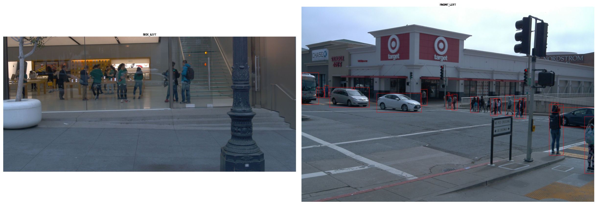
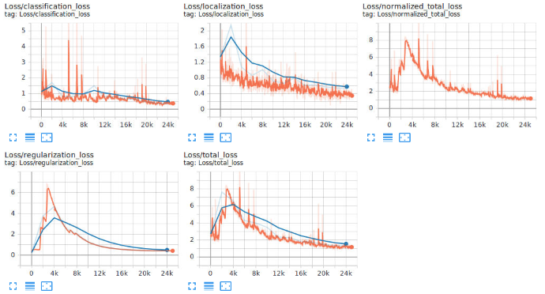
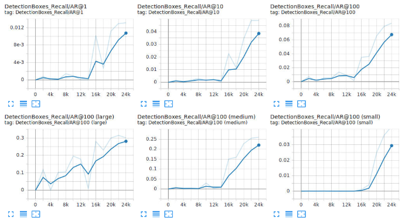
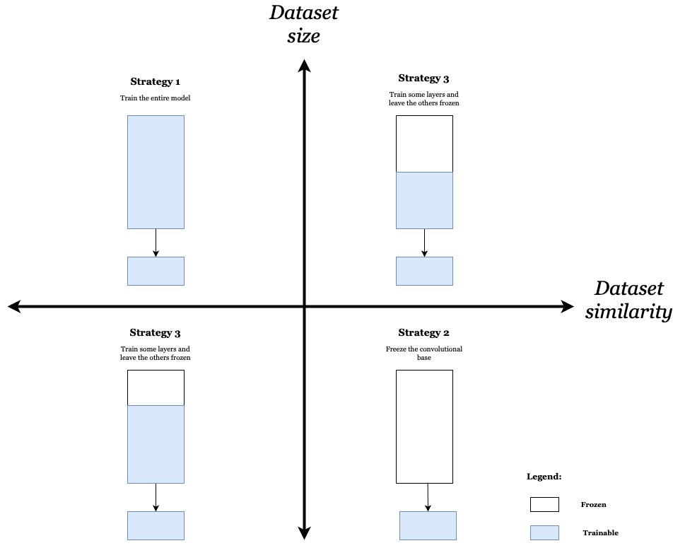
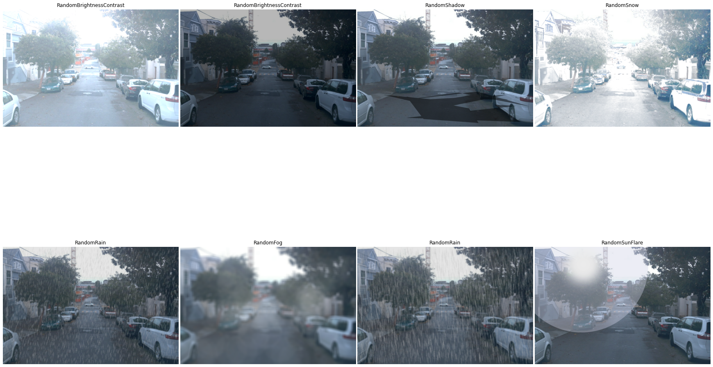

# Project 1.1: Object Detection in Urban Environments
## Report
#### By Jonathan L. Moran (jonathan.moran107@gmail.com)
From the Self-Driving Car Engineer Nanodegreee programme offerred at Udacity.


## Introduction
In this assignment we are tasked with training a 2D object detection pipeline using the TensorFlow Object Detection API [1]. We start with a pre-trained RetinaNet50 architecture — the Single-Shot MultiBox Detector (SSD) with ResNet-50 v1 Feature Pyramid Network (FPN) feature extractor. The model has been pre-trained on the [COCO 2017 dataset](http://cocodataset.org/) and its configuration file and checkpoint weights are made available for download on [TensorFlow Hub](https://tfhub.dev/tensorflow/retinanet/resnet50_v1_fpn_640x640/1) and [TensorFlow 2 Detection Model Zoo](https://github.com/tensorflow/models/blob/master/research/object_detection/g3doc/tf2_detection_zoo.md).

## Getting started
In this project we make use of the TensorFlow Object Detection API, an open-source framework built on top of TensorFlow. The Object Detection API makes it easy to construct, train and deploy object detection models either from scratch or from many state-of-the-art model architectures such as [EfficientDet](https://arxiv.org/abs/1911.09070). 

An excellent step-by-step installation and setup guide is made available [here](https://tensorflow-object-detection-api-tutorial.readthedocs.io/en/latest/install.html). Also on the TensorFlow Object Detection API tutorial website is the [Training Custom Object Detector](https://tensorflow-object-detection-api-tutorial.readthedocs.io/en/latest/training.html) guide which came in handy for this project. Google's TensorFlow has also made efforts to provide tutorials in their [GitHub repository](https://github.com/tensorflow/models/tree/master/research/object_detection/g3doc), but do note that some implementation details are missing or are out-of-date.

To get started, clone the TF [`models`](https://github.com/tensorflow/models) repository and its dependencies ([`protobuf`](https://github.com/google/protobuf/releases) and the `pycocotools` COCO API) and follow the remaining instructions on the installation guide above. A full list of required packages for the TF Object Detection API can be found in the [`setup.py`](https://github.com/tensorflow/models/blob/master/research/object_detection/packages/tf2/setup.py) file.

For this project you will need access to a GPU/TPU and a Linux development environment. While [Google Colab](https://research.google.com/colaboratory/faq.html) instances work in theory, I ran into many dependency issues and ultimately was unable to run my final project without errors. In the Udacity programme, we are able to utilise a Linux Ubuntu LTS virtual machine (VM) with [Tesla K80](https://www.nvidia.com/en-gb/data-center/tesla-k80/) 24 GB GPU accelerator. The VM has its own set of issues, but I was ultimately able to run the training loop without the dependency issues I ran into with Google Colab. In order to use the Udacity VM, two workarounds are needed. The first is an installation of a browser that can handle Jupyter notebooks without crashing.

To install and run Epiphany browser, 
```bash
sudo apt-get purge -y firefox
sudo apt-get install -y epiphany-browser
epiphany
```
To launch a Jupyter notebook instance,
```bash
jupyter notebook --port 3002 --ip=0.0.0.0 --allow-root
```

Note that the Udacity VM comes pre-loaded with most of the libraries needed for this project. To update/install the remainder of the dependencies, run the scripts inside the `2022-10-11-Setup-and-Training.ipynb` notebook. Lastly, make sure that the project folder is added to the [PYTHONPATH](https://bic-berkeley.github.io/psych-214-fall-2016/using_pythonpath.html). One way to do this automatically is by executing a
```python
pip install --editable {DIR_BASE}
```
command, where `DIR_BASE` is the path to your project directory. Note that a custom [`setup.py`](https://github.com/jonathanloganmoran/ND0013-Self-Driving-Car-Engineer/blob/61d9b6f6554462f3b946cd2a2ba51823faefbcd7/1-Computer-Vision/1-1-Object-Detection-in-Urban-Environments/setup.py) file must be included in the top-level project directory which uses the `setuptools` library to install the project modules into your `site-packages` or equivalent directory. For more information, see the [`setuptools` Development Mode (a.k.a "Editable Installs")](https://setuptools.pypa.io/en/latest/userguide/development_mode.html#development-mode-a-k-a-editable-installs) guide.

## Waymo Open Dataset API

#### Introduction
For the task of 2D object detection in the driving environment, we need a comprehensive dataset of driving footage annotated with reliable 2D bounding box data. The [Waymo Open Dataset](https://waymo.com/open) [2] meets this requirement. The multi-sensor, multi-modal [Perception](https://waymo.com/open/data/perception/) dataset consists of both LiDAR and camera data annotated with 2D/3D bounding boxes, key points, 2D-to-3D correspondences and 3D semantic segmentation. In our task we will make use of the 2D bounding box annotations belonging to three distinct classes; _pedestrians_, _vehicles_ and _cyclists_.  clip is a 20-second segment of images captured at 10Hz across two primary locations in the United States: San Francisco, California and Phoenix, Arizona. The geo-fenced regions within these two cities have been defined in the [Sun, P., et al. (2019)](https://arxiv.org/abs/1912.04838) paper. To explore the data and its class label distributions, see the notebooks in the `Exploratory-Data-Analysis` folder. Alternatively, check out the [Know Your Data](https://knowyourdata-tfds.withgoogle.com/#tab=STATS&dataset=waymo_open_dataset) entry and look through some of the 990.340 available frames to find segments of interest. To obtain access to the private Google Cloud Storage bucket that hosts the dataset, fill out the request form [here](https://waymo.com/open/licensing/). Once you have been granted access, you need to install and authenticate the [Google Cloud CLI](https://cloud.google.com/storage/docs/gsutil_install#linux) in order to fetch the records from the GCS bucket.


#### Installing the API

The Waymo Open Dataset API can be installed with the following command
```python
python -m pip install waymo-open-dataset-tf-2-x-y 
```
where `2-x-y` indicates the version of TensorFlow to install alongside the API. 

Currently, the Waymo Open Dataset supports TensorFlow versions 2.0.0 through 2.6.0. In this project we used the `waymo-open-dataset-tf-2-6-0==1.4.9` package in Google Colab and the `waymo-open-dataset-tf-2-3-0==1.3.1` version on Linux Ubuntu LTS. Note that Google Colab recently upgraded to TensorFlow 2.10.x support by default, and with little to no `virtualenv` or `conda` support, Colab instances result in too many package conflicts to reliably reproduce experiments in this project. 

As of writing, Linux is the only supported OS.


#### Using the API

To read and parse the Waymo `.tfrecord` files manually, use the Waymo Open Dataset API and follow the tutorial [here](https://github.com/waymo-research/waymo-open-dataset/blob/17f070076dad149766357b31e25d27cf8b5da6ac/tutorial/tutorial.ipynb). 

In order to use the Waymo dataset with the TF Object Detection API, we have converted the  `.tfrecord` files  into [`tf.train.Example`](https://www.tensorflow.org/api_docs/python/tf/train/Example) protos and [`tf.data.TFRecordDataset`](https://www.tensorflow.org/api_docs/python/tf/data/TFRecordDataset) objects. The [`scripts/preprocessing/download_process.py`](https://github.com/jonathanloganmoran/ND0013-Self-Driving-Car-Engineer/blob/1-1-Object-Detection-2D/1-Computer-Vision/1-1-Object-Detection-in-Urban-Environments/scripts/preprocessing/download_process.py) script does just that. We use a small subset of 100 records from the available <800 records due to space limitations. These 100 records have been processed and split into train/test/validation subsets using the [`scripts/preprocessing/create_splits.py`](https://github.com/jonathanloganmoran/ND0013-Self-Driving-Car-Engineer/blob/61d9b6f6554462f3b946cd2a2ba51823faefbcd7/1-Computer-Vision/1-1-Object-Detection-in-Urban-Environments/scripts/preprocessing/create_splits.py) script.


## Exploratory Data Analysis (EDA) 

#### Introduction

The first notebook, [`2022-09-29-Exploratory-Data-Analysis-Part-1.ipynb`](https://github.com/jonathanloganmoran/ND0013-Self-Driving-Car-Engineer/blob/34c5dca4c98d603cae97d39f8c789f172a428e10/1-Computer-Vision/1-1-Object-Detection-in-Urban-Environments/Exploratory-Data-Analysis/2022-09-29-Exploratory-Data-Analysis-Part-1.ipynb), goes over the contents of the data. Namely, an overview of the class labels, bounding box data, and structure of the Waymo `Frame` instances. A method for parsing the frames and visualising their images and bounding boxes is presented alongside an overview of the driving scenes represented across the dataset.

#### Previewing the dataset

The [`scripts/data_analysis/download_extract.py`](https://github.com/jonathanloganmoran/ND0013-Self-Driving-Car-Engineer/blob/61d9b6f6554462f3b946cd2a2ba51823faefbcd7/1-Computer-Vision/1-1-Object-Detection-in-Urban-Environments/scripts/data_analysis/download_extract.py) script was used to fetch the Waymo dataset files from their GCS location and extract their scene attribute and bounding box data into a Pandas DataFrame. The result was saved to a `.csv` file which has been made available to you in this repository. The total size of the Waymo Open Dataset v1.2 for Perception is 336 GiB. Of the 780+ records available on the GCS bucket, we collected the first 100 listed in the [`data/waymo_open_dataset/filenames.txt`](https://github.com/jonathanloganmoran/ND0013-Self-Driving-Car-Engineer/blob/61d9b6f6554462f3b946cd2a2ba51823faefbcd7/1-Computer-Vision/1-1-Object-Detection-in-Urban-Environments/data/waymo_open_dataset/filenames.txt) file. This subset of the dataset amounted to approximately 150 GiB. In the [`download_extract.py`](https://github.com/jonathanloganmoran/ND0013-Self-Driving-Car-Engineer/blob/61d9b6f6554462f3b946cd2a2ba51823faefbcd7/1-Computer-Vision/1-1-Object-Detection-in-Urban-Environments/scripts/data_analysis/download_extract.py) script file is a `SIZE` variable that allows one to indicate the number of files to fetch from GCS in a single batch. By default, the downloaded files are set to be automatically deleted after the corresponding `.csv` file is created. You can also modify this behaviour inside the script file.


<a href="https://github.com/jonathanloganmoran/ND0013-Self-Driving-Car-Engineer/blob/34c5dca4c98d603cae97d39f8c789f172a428e10/1-Computer-Vision/1-1-Object-Detection-in-Urban-Environments/Exploratory-Data-Analysis/2022-09-29-Exploratory-Data-Analysis-Part-1.ipynb" target="_blank" rel="noopener noreferrer">

</a>

$$
\begin{align}
\textrm{Fig. 1. A snapshot from the Waymo Open Dataset; a diverse range of driving scenarios.} \\
\end{align}
$$


#### Label distributions

In the second notebook, [`2022-09-29-Exploratory-Data-Analysis-Part-2.ipynb`](https://github.com/jonathanloganmoran/ND0013-Self-Driving-Car-Engineer/blob/34c5dca4c98d603cae97d39f8c789f172a428e10/1-Computer-Vision/1-1-Object-Detection-in-Urban-Environments/Exploratory-Data-Analysis/2022-09-29-Exploratory-Data-Analysis-Part-2.ipynb), a set of 100 records are fetched from the GCS bucket using the [`download_extract.py`](https://github.com/jonathanloganmoran/ND0013-Self-Driving-Car-Engineer/blob/61d9b6f6554462f3b946cd2a2ba51823faefbcd7/1-Computer-Vision/1-1-Object-Detection-in-Urban-Environments/scripts/data_analysis/download_extract.py) script. From that subset we take a look at the class label distributions, sensor modalities, and scene metadata. We also highlight important considerations for this dataset, namely the lack of weather variation in the subset, and raise concern over missing or incorrect bounding box data. We also propose further EDA tasks and introduce the motivation behind several hypotheses.

<a href="https://github.com/jonathanloganmoran/ND0013-Self-Driving-Car-Engineer/blob/34c5dca4c98d603cae97d39f8c789f172a428e10/1-Computer-Vision/1-1-Object-Detection-in-Urban-Environments/Exploratory-Data-Analysis/2022-09-29-Exploratory-Data-Analysis-Part-2.ipynb" target="_blank" rel="noopener noreferrer">

</a>

$$
\begin{align}
\textrm{Fig. 2. Label and scene attribute distributions from a sample of 100 `.tfrecord` files in the Waymo Open Dataset.} \\
\end{align}
$$


#### Annotation errors

<a href="https://github.com/jonathanloganmoran/ND0013-Self-Driving-Car-Engineer/blob/34c5dca4c98d603cae97d39f8c789f172a428e10/1-Computer-Vision/1-1-Object-Detection-in-Urban-Environments/Exploratory-Data-Analysis/2022-09-29-Exploratory-Data-Analysis-Part-2.ipynb" target="_blank" rel="noopener noreferrer">

</a>

$$
\begin{align}
\textrm{Fig. 3. Annotation errors in the Waymo Open Dataset: missing bounding boxes for 'pedestrian' class.} \\
\end{align}
$$


## Training

#### Editing the configuration file
In order to use the TensorFlow Object Detection API, the [`pipeline.config`](https://github.com/jonathanloganmoran/ND0013-Self-Driving-Car-Engineer/blob/1-1-Object-Detection-2D/1-Computer-Vision/1-1-Object-Detection-in-Urban-Environments/experiments/pretrained_model/ssd_resnet50_v1_fpn_640x640_coco17_tpu-8/pipeline.config) file must be modified. This `proto` configuration file tells the API everything it needs to know about the model architecture, training hyperparameters, checkpoint and evaluation paths, etc to use. 

Editing the configuration file isn't well documented, but a [short explanation](https://github.com/tensorflow/models/blob/5f4e89369f355ab1e36b9198754883b3482153e1/research/object_detection/g3doc/configuring_jobs.md) exists on the TensorFlow repository. A more in-depth guide to configuration files can be found [here](https://github.com/yasserius/tf2-object-detection-api#edit-the-configuration-files-from-model-zoo). We will be using the [`scripts/training/edit_config.py`](https://github.com/jonathanloganmoran/ND0013-Self-Driving-Car-Engineer/blob/61d9b6f6554462f3b946cd2a2ba51823faefbcd7/1-Computer-Vision/1-1-Object-Detection-in-Urban-Environments/scripts/training/edit_config.py) script to update many of the `train_config` and `eval_config` proto definitions inside the existing [`pipeline.config`](https://github.com/jonathanloganmoran/ND0013-Self-Driving-Car-Engineer/blob/1-1-Object-Detection-2D/1-Computer-Vision/1-1-Object-Detection-in-Urban-Environments/experiments/pretrained_model/ssd_resnet50_v1_fpn_640x640_coco17_tpu-8/pipeline.config) file. The [`edit_config.py`](https://github.com/jonathanloganmoran/ND0013-Self-Driving-Car-Engineer/blob/61d9b6f6554462f3b946cd2a2ba51823faefbcd7/1-Computer-Vision/1-1-Object-Detection-in-Urban-Environments/scripts/training/edit_config.py) script is used as follows

```python
python3 edit_config.py \
    dataset.train=TRAIN dataset.test=TEST dataset.val=VAL \
    dataset.label_map_path=LABEL_MAP_PATH \
    ...
```

which creates a [`pipeline_new.config`](https://github.com/jonathanloganmoran/ND0013-Self-Driving-Car-Engineer/blob/c1551241eac14b8beeccf0cbb3c9075164024c73/1-Computer-Vision/1-1-Object-Detection-in-Urban-Environments/experiments/pretrained_model/ssd_resnet50_v1_fpn_640x640_coco17_tpu-8/pipeline_new.config) file. Running the above script without command line arguments will create a configuration file with the default parameters specified in [`configs/model/ssd_resnet50.yaml`](https://github.com/jonathanloganmoran/ND0013-Self-Driving-Car-Engineer/blob/61d9b6f6554462f3b946cd2a2ba51823faefbcd7/1-Computer-Vision/1-1-Object-Detection-in-Urban-Environments/configs/model/ssd_resnet50.yaml). Otherwise, you may override any of the arguments available using the Hydra [Basic Override syntax](https://hydra.cc/docs/advanced/override_grammar/basic/). 

For more information on using the script, run `python3 edit_config.py --help`.


#### Starting the training loop
To start the training process from the [`2022-10-11-Setup-and-Training.ipynb`](https://github.com/jonathanloganmoran/ND0013-Self-Driving-Car-Engineer/blob/61d9b6f6554462f3b946cd2a2ba51823faefbcd7/1-Computer-Vision/1-1-Object-Detection-in-Urban-Environments/2022-10-11-Setup-and-Training.ipynb) notebook, run the following script:
```python
python3 model_main_tf2.py \
    --pipeline_config_path={PIPELINE_CONFIG_PATH} \
    ...
```

Note that as of writing, Hydra syntax is **not** used to run either the [`model_main_tf2.py`](https://github.com/jonathanloganmoran/ND0013-Self-Driving-Car-Engineer/blob/1-1-Object-Detection-2D/1-Computer-Vision/1-1-Object-Detection-in-Urban-Environments/experiments/model_main_tf2.py) or [`exporter_main_v2.py`](https://github.com/jonathanloganmoran/ND0013-Self-Driving-Car-Engineer/blob/1-1-Object-Detection-2D/1-Computer-Vision/1-1-Object-Detection-in-Urban-Environments/experiments/exporter_main_v2.py) script. This is due to an issue mentioned [here](https://github.com/jonathanloganmoran/ND0013-Self-Driving-Car-Engineer/issues/22). Hydra will be replacing the `argparse` functionality in these two scripts as soon as the bug as been resolved.

#### Using TensorBoard

We will use the TensorFlow [TensorBoard](https://www.tensorflow.org/tensorboard/get_started) visualisation tool to keep an eye on our model during the training and evaluation loops. TensorBoard is a feature-packed dashboard containing many important classification and detection metrics for continuous monitoring. With proper setup, you can even visualise performance bottlenecks and TPU compatibility! 

To launch the TensorBoard instance, run


```python
python -m tensorboard.main --logdir {LOG_DIR}
```
then navigate to `http://localhost:6006/` in a separate browser window. Note that the `LOG_DIR` variable here should be the same path pointed to by `MODEL_OUT`.


#### Continuous evaluation during training

To perform continuous evaluation during the training loop, run the following script in a new terminal window:

```python
CUDA_VISIBLE_DEVICES=-1 python experiments/model_main_tf2.py \
    --model_dir {MODEL_DIR} \
    --checkpoint_dir {MODEL_DIR} 
    --pipeline_config_path {PIPELINE_CONFIG_PATH}
```

where `MODEL_DIR` should match the `LOG_DIR` from the previous step. Here the `CUDA_VISIBLE_DEVICES=-1` flag indicates that evaluation should be performed on the CPU. This is necessary for single-worker/non-distributed training configurations as simultaneous evaluation on a GPU occupied by the training loop might throw a `ResourceExhaustedError: OOM` (Out of Memory) error. You must also make sure that your `EVAL_TIMEOUT` duration is set to something sufficiently long (e.g., `5000s`) so that the evaluation script continues to run on standby until a new checkpoint is created by the training loop. 


If for any reason you need to resume training (e.g., VM crashes/disconnects), change the `CHECKPOINT_DIR` to the last-known checkpoint and re-run the [`edit_config.py`](https://github.com/jonathanloganmoran/ND0013-Self-Driving-Car-Engineer/blob/61d9b6f6554462f3b946cd2a2ba51823faefbcd7/1-Computer-Vision/1-1-Object-Detection-in-Urban-Environments/scripts/training/edit_config.py) script to update the [`pipeline_new.config`](https://github.com/jonathanloganmoran/ND0013-Self-Driving-Car-Engineer/blob/c1551241eac14b8beeccf0cbb3c9075164024c73/1-Computer-Vision/1-1-Object-Detection-in-Urban-Environments/experiments/pretrained_model/ssd_resnet50_v1_fpn_640x640_coco17_tpu-8/pipeline_new.config) file with this modification. Training will resume at the last iteration and TensorBoard should have no problems visualising the updates without any discontinuities in the scalar plots.

#### Monitoring GPU utilisation

Lastly, to monitor the GPU utility during training and evaluation, you can utilise either the [`nvtop`](https://github.com/Syllo/nvtop#snap) or [`nvidia-smi`](https://developer.nvidia.com/nvidia-system-management-interface) task monitoring tools.


<a href="https://github.com/jonathanloganmoran/ND0013-Self-Driving-Car-Engineer/blob/c1551241eac14b8beeccf0cbb3c9075164024c73/1-Computer-Vision/1-1-Object-Detection-in-Urban-Environments/out/figures/report/2022-10-16-Figure-4-GPU-Utilisation-Stats.png" target="_blank" rel="noopener noreferrer">

</a>

$$
\begin{align}
\textrm{Fig. 4. GPU statistics obtained with the `nvidia-smi` CLI tool during the model training cycle.} \\
\end{align}
$$

Training the initial model (RetinaNet SSD ResNet-50 v1 with FPN feature extractor) was performed over 25000 steps. The total training time was 6h04m28s on a single [Tesla K80 24 GB](https://www.nvidia.com/en-gb/data-center/tesla-k80/) accelerator (CUDA v11.0 / Driver v450.51.06) provided by Udacity on a Linux Ubuntu LTS VM. GPU utilisation was consistently above 90%, temperature and power draw was ca. 73C / 143 W, respectively. Training was halted before presumed convergence due to storage limitations (available disk space less than checkpoint size). 

#### Training and evaluation losses

The final TensorBoard scalar charts are replicated below:

<a href="https://github.com/jonathanloganmoran/ND0013-Self-Driving-Car-Engineer/blob/c1551241eac14b8beeccf0cbb3c9075164024c73/1-Computer-Vision/1-1-Object-Detection-in-Urban-Environments/out/figures/report/2022-10-16-Figure-5-Losses-25k.png" target="_blank" rel="noopener noreferrer">

</a>

$$
\begin{align}
\textrm{Fig 5. Loss values plotted over 25000 training steps in TensorBoard.} \\
\end{align}
$$

From the above we see that the localization loss reaches a value of $0.298$ by the end of the training at step 24999. Here the orange curve indicates the training losses while the blue curve indicates the evaluation loss computed at each checkpoint. The evaluation and training losses appear to closely track each other over the course of the training cycle, indicating that the model is learning to generalise to both the training and validation data. A steady decline can be observed in all loss values, therefore we conclude that increasing the number of training steps beyond 25000 may result in a further decrease in loss values without risk of overfitting.

## Evaluation

In this section we use the COCO dataset [detection evaluation metrics](http://cocodataset.org/#detection-eval) to score the object detection model during training using both the Mean Average Precision (mAP) and and Average Recall (AR) scores below. Note that with the COCO evaluation criteria, no distinction is made between Average Precision (AP) and Mean Average Precision (mAP). The assumption is that AP refers to the average across all classes.

### Mean Average Precision (mAP)

<a href="https://github.com/jonathanloganmoran/ND0013-Self-Driving-Car-Engineer/blob/c1551241eac14b8beeccf0cbb3c9075164024c73/1-Computer-Vision/1-1-Object-Detection-in-Urban-Environments/out/figures/report/2022-10-16-Figure-6-Precision-25k.png" target="_blank" rel="noopener noreferrer">

</a>

$$
\begin{align}
\textrm{Fig 6. Mean Average Precision (mAP) scores plotted over 25000 training steps in TensorBoard.} \\
\end{align}
$$

A strong upward trend in mAP values is seen across the board. We observe this trend in mAP values for small ($\mathrm{area} < 32^2 px$), medium ($32^2 px < \mathrm{area} < 96^2 px$) and large ($\mathrm{area} > 96^2 px$) objects. From the above we also see a sharp increase in AP@.50 (AP at IoU=0.5) and AP@.75 (AP at IoU=0.75) scores starting at step 14000. This trend continues across mAP values for the remainder of the training cycle. This suggests that additional training steps may improve mAP scores.

### Average Recall (AR)

<a href="https://github.com/jonathanloganmoran/ND0013-Self-Driving-Car-Engineer/blob/c1551241eac14b8beeccf0cbb3c9075164024c73/1-Computer-Vision/1-1-Object-Detection-in-Urban-Environments/out/figures/report/2022-10-16-Figure-7-Recall-25k.png" target="_blank" rel="noopener noreferrer">

</a>

$$
\begin{align}
\textrm{Fig 7. Average Recall (AR) scores plotted over 25000 training steps in TensorBoard.} \\
\end{align}
$$

Similarly, we see that AR scores increase sharply after the 14k step mark. Here the AR@max values indicate that the AR was computed given $\mathrm{max}$ number of detections per image. For the AR@100 large (AR given 100 detections per of large objects), we see a strong increase throughout the entire training cycle. This might be reflecting the stronger performance of our model on the 'vehicle' class. Given that this class is represented much more in our dataset, we assume the localisation performance to be strong here.


### Object detection across various driving scenes


Now, for the moment of truth... let's see how our trained object detection model performs in the real-world. To start, we'll consider a few scenes that are relatively trivial, then we'll look at several complex scenes where the model (\*spoiler alert\*) completely fails.


#### Urban neighbourhoods

<a href="https://github.com/jonathanloganmoran/ND0013-Self-Driving-Car-Engineer/blob/c1551241eac14b8beeccf0cbb3c9075164024c73/1-Computer-Vision/1-1-Object-Detection-in-Urban-Environments/out/figures/report/2022-10-16-Figure-8-Evaluation-1.gif" target="_blank" rel="noopener noreferrer">

</a>

$$
\begin{align}
\textrm{Fig 8. Evaluation on the Waymo Open Dataset: object detection in urban neighbourhoods.} \\
\end{align}
$$

From the above we see that the object detection model seemed to consistently predict both the correct class and correct location of the vehicle bounding boxes. This scene isn't particularly exciting, however, other than the fact that the [Waymo Driver](https://waymo.com/waymo-driver/) (synonymous with _ego vehicle_ in this report) enters an uncontrolled [T-intersection](https://en.wikipedia.org/wiki/Three-way_junction) in two hilly urban neighbourhoods. In the right clip, there are several construction cones lined up along the curb, but there is nothing interfering the path of the Driver.

In this next clip, we'll look at two more challenging driving conditions.

#### Challenges: Poor lighting conditions

<a href="https://github.com/jonathanloganmoran/ND0013-Self-Driving-Car-Engineer/blob/c1551241eac14b8beeccf0cbb3c9075164024c73/1-Computer-Vision/1-1-Object-Detection-in-Urban-Environments/out/figures/report/2022-10-16-Figure-9-Evaluation-2.gif" target="_blank" rel="noopener noreferrer">

</a>

$$
\begin{align}
\textrm{Fig 9. Evaluation on the Waymo Open Dataset: object detection in poor lighting conditions.} \\
\end{align}
$$

On the left, we have a nighttime scene from a residential neighbourhood in San Francisco. On the right, we have a very foggy, freshly wet street in a less busy part of town. In both conditions, we see that the model fails to localise several objects in the scene. In the left clip, the Waymo Driver approaches a 4-way uncontrolled intersection. On the other side is a dimly lit vehicle stopped behind the crosswalk. The model fails to detect the oncoming vehicle, presumably because of poor lighting conditions; the fact that the vehicle's headlights aren't on doesn't make anything easier. In the right clip, the model fails to detect the white pickup truck adjacent to the Waymo vehicle on the left. The pickup truck becomes slightly occluded by fog towards the end of the clip, but as it enters the frame in the beginning it is absolutely recognisable to the human eye. These two examples set the scene for the rest of the clips, where performance in semi-ordinary conditions leaves much to be desired. Now onto pedestrians...


#### Challenges: Pedestrians

<a href="https://github.com/jonathanloganmoran/ND0013-Self-Driving-Car-Engineer/blob/c1551241eac14b8beeccf0cbb3c9075164024c73/1-Computer-Vision/1-1-Object-Detection-in-Urban-Environments/out/figures/report/2022-10-16-Figure-10-Evaluation-3.gif" target="_blank" rel="noopener noreferrer">

</a>

$$
\begin{align}
\textrm{Fig 10. Evaluation on the Waymo Open Dataset: object detection for the 'pedestrian' class.} \\
\end{align}
$$

We've reached what is absolutely the most concerning part of this evaluation of the object detection model: pedestrian detection performance. Right away we see that the model completely fails to detect a number of pedestrians at marked crosswalks. The Waymo vehicle is stationary during the duration of these two clips, and there doesn't seem to be anything too strange with the scene/lighting conditions. The model seems to be properly detecting the _presence_ of pedestrians in the scene but remarkably fails to localise them. On the left, we have a foggy San Francisco neighbourhood with a handful of pedestrians crossing in front of the Waymo vehicle. Th model seems to detect almost perfectly the number of vehicles in the scene, but again fails to appropriately label objects of the pedestrian class. Interestingly, several of the pedestrians are labelled as "vehicle" objects, but a few pedestrians are unlabelled entirely. 

The model in its current state seems to exhibit effects of class imbalance, as discovered in [`2022-09-29-Exploratory-Data-Analysis-Part-2.ipynb`](https://github.com/jonathanloganmoran/ND0013-Self-Driving-Car-Engineer/blob/34c5dca4c98d603cae97d39f8c789f172a428e10/1-Computer-Vision/1-1-Object-Detection-in-Urban-Environments/Exploratory-Data-Analysis/2022-09-29-Exploratory-Data-Analysis-Part-2.ipynb). The model in its current state is in no way ready to be deployed in the vehicle, and more attention must be given to address the class imbalance and training data diversity. Its performance on the 'pedestrian' class is of huge concern; especially given that its [National Pedestrian Safety Month](https://www.nhtsa.gov/press-releases/us-department-transportation-designates-october-national-pedestrian-safety-month).


#### Generalisability: suburban roads

<a href="https://github.com/jonathanloganmoran/ND0013-Self-Driving-Car-Engineer/blob/c1551241eac14b8beeccf0cbb3c9075164024c73/1-Computer-Vision/1-1-Object-Detection-in-Urban-Environments/out/figures/report/2022-10-16-Figure-11-Evaluation-4.gif" target="_blank" rel="noopener noreferrer">

</a>

$$
\begin{align}
\textrm{Fig 11. Evaluation on the Waymo Open Dataset: object detection in generalised environments — suburban roads.} \\
\end{align}
$$

This last category is interesting to see how our model performs in other driving environments. The focus of this assignment is on object detection in urban environments, but here we evaluate the performance of the model in two distinct environments: suburban and freeway.

In the figure below, the object detection model seems to do fairly well at localising the vehicles in the scene. On the left, all vehicles surrounding the Waymo Driver are detected. We can even see that a few vehicles on the other side of the divided corridor (a good ol' American [stroad](https://en.wikipedia.org/wiki/Stroad)) are detected correctly. One alarming thing about the clip on the left is that again, our model fails to detect the pedestrian crossing the car park entrance. About half-way through the road, the pedestrian is recognised by the model but incorrectly labelled as a vehicle. Not great. On the right clip, we have a the Waymo Driver making an unprotected left turn through a controlled 4-way intersection. The intersection is busy with oncoming traffic — cars with the right of way are entering the intersection, and there are also cars stopped at the middle of the intersection waiting to make their own unprotected left turn. All vehicles in the scene seem to be appropriately labelled, but there are a number of ghost objects detected in the background.

#### Generalisability: freeway driving

<a href="https://github.com/jonathanloganmoran/ND0013-Self-Driving-Car-Engineer/blob/c1551241eac14b8beeccf0cbb3c9075164024c73/1-Computer-Vision/1-1-Object-Detection-in-Urban-Environments/out/figures/report/2022-10-16-Figure-12-Evaluation-5.gif" target="_blank" rel="noopener noreferrer">

</a>

$$
\begin{align}
\textrm{Fig 12. Evaluation on the Waymo Open Dataset: object detection in generalised environments — freeway driving.} \\
\end{align}
$$

Lastly, we have two clips of very standard freeway driving. On the left, we notice that our model takes a second to detect the pickup truck to the Waymo Driver's left. We could say that the initially-visible front end of the truck shares a similar hue to the road beneath it, but there shouldn't be any exceptions made in regards to performance. The sectioned-off HOV/carpool lane doesn't seem to complicate the scene, as the model has no issues detecting the nearby vehicles. On the right, we notice nothing alarming. The right-most vehicle in the distance goes in and out of detection, but otherwise the vehicles closely surrounding the Waymo Driver are detected without a problem.


#### In summary

Overall, we can give some praise to the model for being able to generalise to these two environments; the "vehicle" class detector is decent across driving environments. Despite this, the model needs a lot more work before it is ready for the road.


## Closing Remarks

### Model Improvements
In summary, the following changes to the model are recommended:
* Training steps: increasing from 25000 to 35000;
* Learning rate schedule: decrease initial learning rate, implement different schedule;
* Optimiser: switching out the optimiser to e.g., Adam.

From the scalar charts shown in TensorBoard, the losses did not seem to reach a steady plateau. A longer training duration could help mitigate this by allowing the model more iterations to drive the losses down even further. Thus, we propose increasing the number of training steps by 15000.


#### Fine-tuning strategies

One other consideration for our current model is an adjustment to the fine-tuning training approach. Below is a _size-similarity_ governing the use of transfer learning applied to custom datasets:

<a href="https://github.com/jonathanloganmoran/EDAN95-Applied-Machine-Learning/blob/a246bac278c7fd81094154828053086716a45c15/3-CNNs/2019-11-22-Convolutional-Neural-Networks.ipynb" target="_blank" rel="noopener noreferrer">

</a>

$$
\begin{align}
\textrm{Fig 13. Size-similarity matrix: transfer learning fine-tuning strategies based on custom dataset size and similarity to source dataset (pre-trained).} \\
\end{align}
$$

The source dataset, i.e., the [COCO 2017](https://blog.roboflow.com/coco-dataset) dataset, contains 121.408 images with 888.331 object annotations across 80 distinct classes. The median image ratio is 640x640. Within the 80 classes are several relevant to our target domain: _cars_, _motorbike_, _bicycle_, _person_, _traffic light_, _bus_, _fire hydrant_, _stop sign_ and _parking meter_. Of these nine transferrable classes, _person_, _car_ and _traffic light_ and represented the most in the COCO dataset at 10777, 1918 and 634 labels, respectively. Since we are unsure of the number of _pedestrian_ images in the COCO dataset, we cannot be overly-confident with our expectations for performance in this class (as we have seen in the results above). Referring to the size-similarity matrix in Fig. 13, we can make some assumptions. Given that we have a subset of 20000 object labels from the Waymo Open Dataset, we think its "size" falls somewhere along the upper-half of the matrix, giving us a choice between Strategy 1 or Strategy 3. Because we have assumed there to be _some_ similarity between the Waymo Open Dataset and COCO 2017 dataset classes, we can conclude that Strategy 3 is most appropriate.

Now, given our current [`pipeline_new.config`](https://github.com/jonathanloganmoran/ND0013-Self-Driving-Car-Engineer/blob/c1551241eac14b8beeccf0cbb3c9075164024c73/1-Computer-Vision/1-1-Object-Detection-in-Urban-Environments/experiments/pretrained_model/ssd_resnet50_v1_fpn_640x640_coco17_tpu-8/pipeline_new.config) file, we make several modifications that dictate our fine-tuning strategy. First is the modification of the single-shot feature extractor (SSD). The [`override_base_feature_extractor`](https://github.com/tensorflow/models/blob/8ed878f440c204fbc75ac7f798d95e152cdda7db/research/object_detection/protos/ssd.proto#L172) flag is set to `true`, meaning that both the base SSD feature extractor \*and\* the additional convolutional layers added on top of the SSD will have their hyperparameter values overwritten during training. The default behaviour for this parameter is set to `false`, such that the base SSD feature extractor's hyperparameters are preserved. According to the [`train.proto`](https://github.com/tensorflow/models/blob/master/research/object_detection/protos/train.proto), we have the freedom to specify which layers we want to _freeze_, i.e., prevent their weights from changing during training. In our current implementation, we are not explicit regarding the layers to freeze, and therefore we are re-training the entire network by default. While Strategy 3 in Fig. 13 isn't explicit about which layers to freeze and which to leave as trainable, we will presumably benefit from freezing a subset of layers in our model. This would speed up the training process by decreasing the total number of trainable parameters. To do so, specify the individual layers as a list of strings to the [`freeze_variables`](https://github.com/tensorflow/models/blob/8ed878f440c204fbc75ac7f798d95e152cdda7db/research/object_detection/protos/train.proto#L114) definition in [`train.proto`](https://github.com/tensorflow/models/blob/master/research/object_detection/protos/train.proto). A good explanation of how to do accomplish this is found [here](https://stackoverflow.com/a/55965615). This is commonly referred to as _layer-_ or _block-wise fine-tuning_.


### Dataset Considerations
* Address class imbalance ('pedestrian', 'cyclist');
* Improve training set diversity (e.g., weather, underrepresented classes);
* Consider using other sensor data (e.g., 2D-to-3D correspondences, 3D bounding box data).


#### Class imbalances

From the results of [`2022-09-29-Exploratory-Data-Analysis-Part-2.ipynb`](https://github.com/jonathanloganmoran/ND0013-Self-Driving-Car-Engineer/blob/34c5dca4c98d603cae97d39f8c789f172a428e10/1-Computer-Vision/1-1-Object-Detection-in-Urban-Environments/Exploratory-Data-Analysis/2022-09-29-Exploratory-Data-Analysis-Part-2.ipynb) we know that an initial subset of 100 `.tfrecord` files contained an insufficient (zero) number of driving scenes in weather conditions other than class `'sunny'`. Waymo claims to have collected data across a diverse range of weather conditions from fog to heavy rain (which we have highlighted in [`2022-09-29-Exploratory-Data-Analysis-Part-1.ipynb`](https://github.com/jonathanloganmoran/ND0013-Self-Driving-Car-Engineer/blob/34c5dca4c98d603cae97d39f8c789f172a428e10/1-Computer-Vision/1-1-Object-Detection-in-Urban-Environments/Exploratory-Data-Analysis/2022-09-29-Exploratory-Data-Analysis-Part-1.ipynb)). We also know that there is a significant class imbalance for the 'pedestrian' and 'cyclist' classes, and the effects of this are clearly highlighted in the results obtained above. Further considerations need to be made to ensure that our training subset encompasses a number of records in these conditions.


#### Data augmentation

In cases where diverse data is either not available or impossible to collect, data augmentation strategies may be appropriate. In [Exercise 1.4.3](https://github.com/jonathanloganmoran/ND0013-Self-Driving-Car-Engineer/blob/8a85ba767212b03c111d9288941ae098880b25d4/1-Computer-Vision/Exercises/1-4-3-Image-Augmentations/2022-09-19-Image-Augmentations.ipynb) we discussed using the [Albumentations](https://albumentations.ai/docs/) library to artificially replicate various weather and time-of-day artifacts with mixed results. 


<a href="https://github.com/jonathanloganmoran/ND0013-Self-Driving-Car-Engineer/blob/8a85ba767212b03c111d9288941ae098880b25d4/1-Computer-Vision/Exercises/1-4-3-Image-Augmentations/2022-09-19-Image-Augmentations.ipynb" target="_blank" rel="noopener noreferrer">

</a>

$$
\begin{align}
\textrm{Fig 14. Image augmentation on the Waymo Open Dataset using Albumentations.} \\
\end{align}
$$

In our current implementation, we utilise [`RandomCropImage`](https://github.com/tensorflow/models/blob/8ed878f440c204fbc75ac7f798d95e152cdda7db/research/object_detection/protos/preprocessor.proto#L207) and disable the [`RandomHorizontalFlip`](https://github.com/tensorflow/models/blob/8ed878f440c204fbc75ac7f798d95e152cdda7db/research/object_detection/protos/preprocessor.proto#L65) used in the standard RetinaNet SSD ResNet-50 architecture. Motivation behind this approach is explained in detail in [Exercise 1.4.3](https://github.com/jonathanloganmoran/ND0013-Self-Driving-Car-Engineer/blob/c1551241eac14b8beeccf0cbb3c9075164024c73/1-Computer-Vision/Exercises/1-4-3-Image-Augmentations/2022-09-19-Image-Augmentations.ipynb) — in short, horizontal flipping flips the direction of any oncoming traffic in a driving scene. In other words, if the Waymo Driver was travelling forward in the right-hand lane (as done in USA), flipping the image would make it appear as if the vehicle was now travelling in the left-hand lane. Therefore, it would be highly undesirable to perform this specific augmentation when training and evaluating vehicle detection models in geographical regions operating with exclusively left- or exclusively right-hand traffic. Since the Waymo Open Dataset was collected across locations in the United States, we can be sure that there exists exclusively right-hand traffic for all but the tail-end edge cases (e.g., wrong-way drivers, work zone traffic control / lane closure on a two-lane road with re-direction, etc.).

Further experimentation must be done to validate the efficacy of these data augmentation approaches. Note that augmentation is not a "quick fix" for this domain, and special attention might need to be given to selecting optimal augmentation parameters. For more on this, see [Exercise 1.4.3](https://github.com/jonathanloganmoran/ND0013-Self-Driving-Car-Engineer/blob/c1551241eac14b8beeccf0cbb3c9075164024c73/1-Computer-Vision/Exercises/1-4-3-Image-Augmentations/2022-09-19-Image-Augmentations.ipynb).

#### Sensor fusion

In regards to the Waymo Open Dataset, there is still a variety of data collected from the other sensor modalities (short- and mid-range LiDAR) that we overlooked for this 2D object detection task. In a later project we will be making use of the LiDAR data to perform 3D object detection. Specifically, we will use the 3D 7-DOF labelled bounding box data. In the Waymo Open Dataset for Perception, 3D key points, 2D-to-3D correspondences, 3D segmentation and 2D video panoptic segmentation data is also available to use for a variety of perception tasks from segmentation to tracking.

### Framework Improvements
As of now, the TensorFlow Object Detection API is actively maintained and supported by a community of contributors. The Object Detection API was initially implemented in TF1 and has been slowly ported to TF2 over time. In its current state, the Object Detection API still relies on the TF1 library and has not yet fully migrated to TF2. Because of this, there are many console warnings at runtime that have gone unaddressed. The accompanying documentation also suffers from inaccurate or otherwise not up-to-date information, making the use of this framework more challenging than not. Despite these setbacks, the TensorFlow Object Detection API is a powerful, highly customisable tool that makes experimenting with state-of-the-art object detection models possible for researchers and enthusiasts alike.


## Future Work
- ⬜️ Train the current model for an additional 15000 steps;
- ⬜️ Investigate current model under-performance on the 'pedestrian' class;
- ⬜️ Experiment with other optimizers, learning rate schedules;
- ⬜️ Experiment with lightweight model architectures (e.g., [Zaibi et al.](https://doi.org/10.1155/2021/8870529) from [Exercise 1.4.2](https://github.com/jonathanloganmoran/ND0013-Self-Driving-Car-Engineer/blob/8a85ba767212b03c111d9288941ae098880b25d4/1-Computer-Vision/Exercises/1-4-2-Building-Custom-CNNs/2022-09-12-Building-Custom-Convolutional-Neural-Networks.ipynb));
- ⬜️ Implement domain-adaptive data augmentation strategies (e.g., artificial weather modification from [Exercise 1.4.3](https://github.com/jonathanloganmoran/ND0013-Self-Driving-Car-Engineer/blob/8a85ba767212b03c111d9288941ae098880b25d4/1-Computer-Vision/Exercises/1-4-3-Image-Augmentations/2022-09-19-Image-Augmentations.ipynb));
- ⬜️ Move training to a distributed strategy and make use of Google Cloud TPU allocation.


## Disclaimer
The author and independent contributor, Jonathan L. Moran, was awarded a computing grant from Google's [TPU Research Cloud](https://sites.research.google/trc/about/) (TRC) programme. This grant covered the allocation costs of 5 on-demand Cloud TPU v3,8 devices, 5 on-demand Cloud TPU v2,8 devices and 100 preemptible Cloud TPU v2,8 devices. All other Google Cloud Engine costs were otherwise incurred by the author. The author also received a donation from L. Vincent in the amount of $10 USD for a 30-day Google Colab Pro subscription. This project was led by Udacity, Inc. in the Self-Driving Car Engineer Nanodegree programme. The author and work completed in this project is not affiliated with any institution or organisation.


## References
* [1] Huang, J. et al., Speed/accuracy trade-offs for modern convolutional object detectors. Proceedings of the IEEE/CVF Conference on Computer Vision and Pattern Recognition (CVPR). 2017. [doi: 10.48550/arXiv.1611.10012](https://arxiv.org/abs/1611.10012).

* [2] Sun, Pei, et al., Scalability in Perception for Autonomous Driving: Waymo Open Dataset. Proceedings of the IEEE/CVF Conference on Computer Vision and Pattern Recognition (CVPR). 2020. [doi: 10.48550/ARXIV.1912.04838](https://arxiv.org/abs/1912.04838).


Helpful resources:
* [Training Custom Object Detector by L. Vladimirov | TensorFlow 2 Object Detection API tutorial](https://tensorflow-object-detection-api-tutorial.readthedocs.io/en/latest/training.html)
* [TensorFlow Object Detection API Tutorial by A. Buragohain | Another Deep-Learning Blog](https://benihime91.github.io/blog/machinelearning/deeplearning/tensorflow2.x/object-detection/tf%20object%20detection%20api/2020/11/02/tensorflow-object-detection.html)
* [Waymo Open Dataset Tutorial by Waymo Research (@waymo-research) | GitHub](https://github.com/waymo-research/waymo-open-dataset/blob/master/tutorial/tutorial.ipynb)
* [RetinaNet (SSD with ResNet-50 v1) Object Detection Model | TensorFlow Hub](https://tfhub.dev/tensorflow/retinanet/resnet50_v1_fpn_640x640/1)