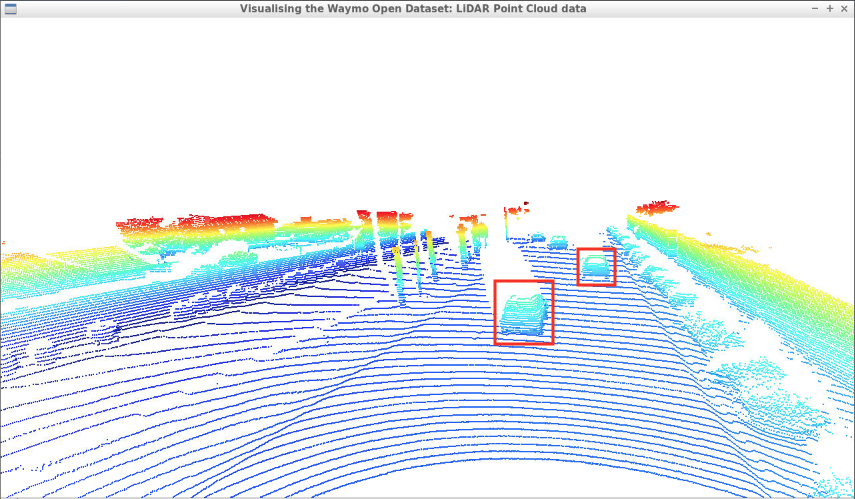
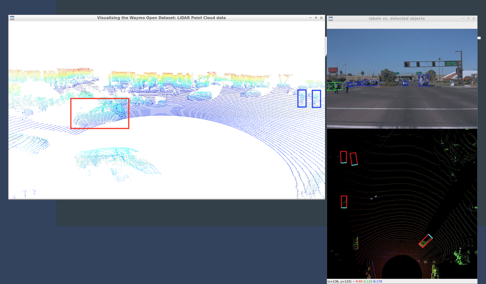
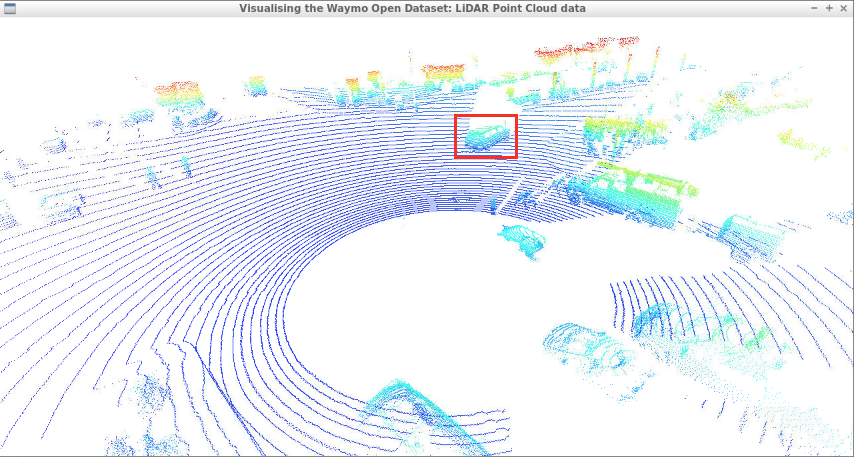
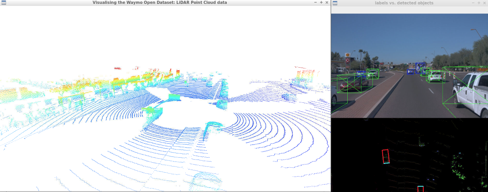
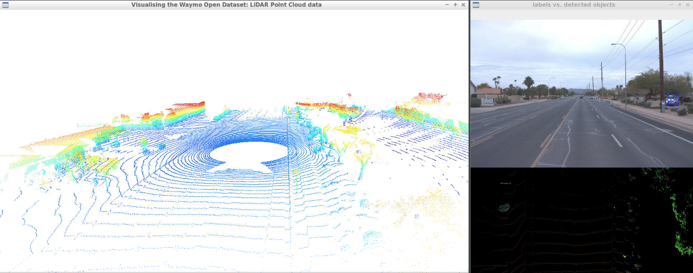
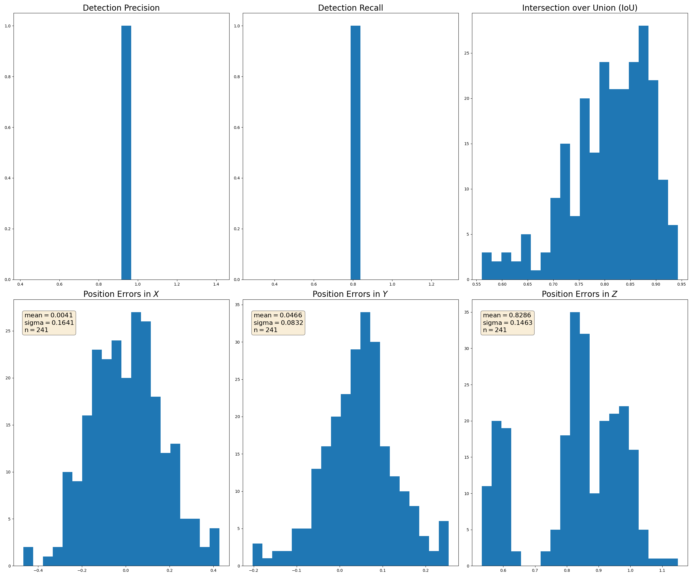
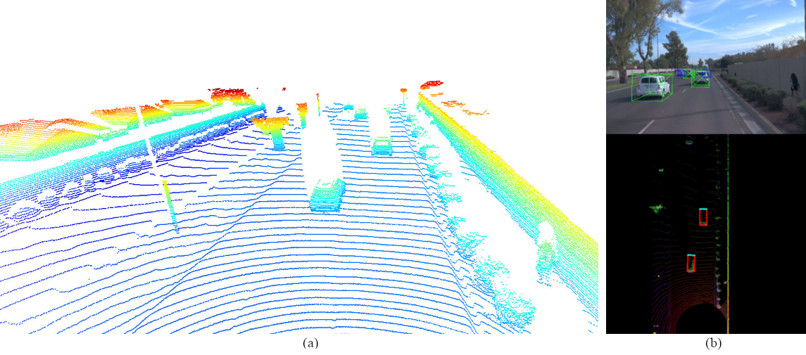
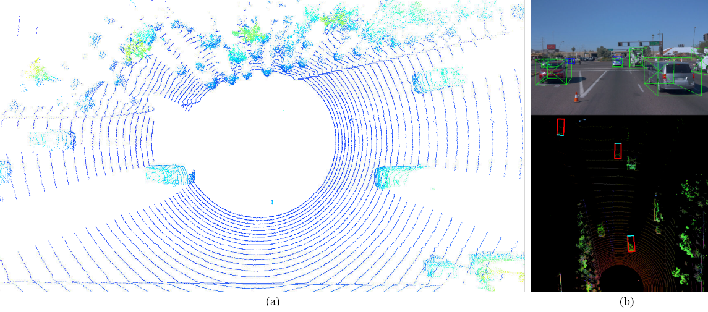

# Project 2.1: 3D Object Detection with LiDAR Data
## Midterm Report
#### By Jonathan L. Moran (jonathan.moran107@gmail.com)
From the Self-Driving Car Engineer Nanodegree programme offered at Udacity.


## Introduction
In this assignment we worked with several pre-trained object detection models to perform 3D object detection over driving data from the [Waymo Open Dataset]() [1]. We wrote several functions to parse the LiDAR data and convert the range images into 3D point clouds. The Open3D [2] library in Python was used to visualise the 3D point cloud data. Using these functions we performed basic exploratory data analysis (EDA) techniques to discover (a) driving scenes with vehicles at varying degrees of visibility, and (b) vehicle features that appeared stable throughout the dataset.

In order to perform inference over these range images, we needed to form a psuedo-RGB (i.e., three-channel image) data structure. Therefore we used the three channels: range, intensity and density. To mitigate the effect of outliers, we re-scaled and normalised the channel values and investigated common LiDAR sensor data cleaning tasks. After our input images were pre-processed, we ran them through several pre-trained object detection networks: the [SFA3D](https://github.com/maudzung/SFA3D) with FPN ResNet-18 backbone [3][4] and the DarkNet (i.e., Complex-YOLO) [5] models. The 3D bounding box coordinates in $(x, y, z, w, h, l)$ were regressed in each model along with a heading angle (the $\textrm{yaw}$ value). These predicted coordinates needed to be projected from BEV image space (in pixels) to the vehicle coordinate system (in metres). Once these coordinates were converted, we formed the appropriate bounding box data structure — an array of $\texttt{[_id, x, y, z, h, w, l, yaw]}$, and visualised the results onto the BEV image and RGB image spaces. This allowed us to visually see the results of our object detection net and verify the accuracy of our model predictions in comparison to the ground-truth labels.


## Exploratory Data Analysis (EDA)
In this section, we perform a basic EDA task across several `segment` files from the Waymo Open Dataset. This task consists of visualising either the LiDAR point cloud or range image data and inspecting each frame in the driving scene for certain features of interest.

### Vehicle Visibility in LiDAR Point Cloud Data
In our first task, we look for varying degrees of vehicle visibility across the LiDAR point cloud frames. Presented are the individual frames selected by the author which contain either low or high vehicle visibility in several categories.

#### Good visibility
Here we have a point cloud image of the front view of the Waymo vehicle. We can clearly identify the vehicles in front of the Waymo vehicle.



$$
\begin{align}
\textrm{Figure 1. Point cloud obtained from the front-view, here the rear-end of the cars in front of the Waymo vehicle are clearly visible (shown in red).}
\end{align}
$$

In this scene we are entering a controlled intersection. There are pedestrians (in blue — construction workers / flaggers) in the middle of the intersection controlling traffic. The oncoming vehicles to the left of the Waymo vehicle are clearly visible (in red),



$$
\begin{align}
\textrm{Figure 2. Point cloud of the front-left view, here the opposing traffic (shown in red) and pedestrians in the intersection (shown in blue) are clearly visible.}
\end{align}
$$


and to the right of the Waymo vehicle (in red, making a right turn through the intersection).



$$
\begin{align}
\textrm{Figure 3. Point cloud of the front-right view, here an adjacent vehicle (shown in red) in the controlled intersection is clearly visible while it completes a right-turn.}
\end{align}
$$

#### Poor visibility
#### Blind spots
It is very apparent that there is a significant blindspot in areas directly surrounding the Waymo vehicle. Here we see that a vehicle immediately to the right of the Waymo vehicle is not fully visible.


$$
\begin{align}
\textrm{Figure 4. Point cloud of the front-right view, here an adjacent vehicle at the intersection is almost completely occluded by the blindspot directly surrounding the Waymo vehicle.}
\end{align}
$$


In the rear of the Waymo vehicle we can clearly make out important road features, e.g., the concrete raised traffic median. However, the truck-and-trailer to the right of the vehicle (shown on left) is only partially visible.



$$
\begin{align}
\textrm{Figure 5. Point cloud of the rear-view, here an adjacent vehicle (truck-and-trailer, shown in red) is only partially visible due to the blindspot.}
\end{align}
$$


#### Distance

Here, the LiDAR sensors failed to detect a very large truck parked to the right of the Waymo vehicle. The truck is parked along the corridor on a paved [shoulder](https://en.wikipedia.org/wiki/Shoulder_\(road\)), and therefore not in the driveable space. However, it was given a ground-truth label (as shown in the image in blue) yet went undetected by the LiDAR unit due to poor resolution.


$$
\begin{align}
\textrm{Figure 6. Point cloud of front-view, here a semi-truck (shown in blue in the RGB image, right) parked on the paved shoulder along the corridor goes undetected by the LiDAR sensor units.}
\end{align}
$$

The semi-truck appears to be clearly distinguishable from the RGB images. Here we emphasise the importance of a multi-modal perception system, as cameras tend to provide remarkable resolution in optimal settings.


### Vehicle Landmarks in LiDAR Range Images
In this second task, we visualise the LiDAR range images and make note of vehicle features that have consistent, highly distinguishable appearances across the frames. We present these features with a short description and highlight their appearance in the range images indicated by a red-coloured box.

#### License plates

The rear license plates on vehicles in front of the Waymo vehicles are easily visible in the LiDAR range images as they are highly reflective and therefore have much larger intensity values.

#### Windshields
Windshields, both in the front of a vehicle and the rear, are easy to distinguish in the LiDAR range images. Glass surfaces (e.g., windshields, windows) do not reflect laser light as significantly as the other surfaces on the exterior of a vehicle, and therefore appear as 'holes' in the LiDAR point clouds and range images.

#### Other features
While outside the scope of this task, it is important to note that other highly-reflective environmental landmarks exist in the driving scene. Namely, retroreflective markers (e.g., [cat's eye](https://en.wikipedia.org/wiki/Cat%27s_eye_\(road\)) lane markers and bicycle reflectors) and [retroreflective sheeting](https://en.wikipedia.org/wiki/Retroreflective_sheeting) materials (e.g., [traffic signs](https://www.3m.com/3M/en_US/road-safety-us/resources/road-transportation-safety-center-blog/full-story/~/astm-standards-for-traffic-signs/?storyid=5011bc7a-64cc-4b28-93cd-84aa9707d5dd), high-visibility clothing). The use of these markers and materials on the road help improve nighttime visibility and can aid in the detection of important landmarks in the driving environment. However, further evaluation needs to be done to consider the implications of highly-reflective surfaces on LiDAR returns. Specifically, saturation of intensity values may occur with retroreflective road signs (i.e., too much energy being returned to the scanner). This effect is in part due to the low angles of incidence from which the readings are collected and sampled from the sign face and is especially noticeable at $-30^{\circ}$ and $-60^{\circ}$ configurations on the signs facing the direction of travel (Olsen et al., pp. 41-42) [6].

### LiDAR Range Image Pre-Processing
Before we move onto the next task, performing inference over the converted BEV image maps, let's briefly discuss the data pre-processing we have done in order to make the range images a bit clearer.

#### Intensity value normalisation
In the [`2022-10-20-Course-2-Sensor-Fusion-Exercises-Part-1.ipynb`](https://github.com/jonathanloganmoran/ND0013-Self-Driving-Car-Engineer/blob/f1544058060bb1e4aa1af8068097ccb5084dd96f/2-Sensor-Fusion/Exercises/2022-10-20-Course-2-Sensor-Fusion-Exercises-Part-1.ipynb) notebook we discussed the need for re-scaling and normalisation, as the LiDAR sensor returns in the Waymo Open Dataset exhibit saturation for highly-reflective surfaces such as license plates. Here we show the results of performing two data normalisation strategies used to mitigate the effect of intensity outliers:


$$
\begin{align}
\textrm{Figure 7. Range images — comparing two intensity value normalisation techniques: (a) min-max and (b) 1- and 99-percentile.}
\end{align}
$$

Above we see the results of the two normalisation techniques. The formula used for _min-max normalisation_ is as follows:
```python
### Performing min-max normalisation on range image intensity values
scale_factor_intensity = np.amax(ri_intensity) - np.amin(ri_intensity)
ri_intensity_scaled = ri_intensity * np.amax(ri_intensity) / 2
ri_intensity_scaled = ri_intensity_scaled * 255. / scale_factor_intensity
```
and the formula for _1- and 99-percentile normalisation_ is:
```python
### Performing 1- and 99-percentile normalisation on range image intensity values
ri_min = np.percentile(ri_intensity, 1)
ri_max = np.percentile(ri_intensity, 99)
np.clip(ri_intensity, a_min=ri_min, a_max=ri_max)
ri_intensity_scaled = np.int_((ri_intensity - ri_min) * 255. / (ri_max - ri_min))
```

From the figure we determine that the percentile-based normalisation technique is more effective at producing cleaner range images. Therefore, we will proceed with this recommendation for our next set of tasks.

After performing data pre-processing, we obtain the following three range image clips:


$$
\begin{align}
\textrm{Figure 8. Range images — visualising three segment files from the Waymo Open Dataset.}
\end{align}
$$


### Implementation Details

#### Switching between sequence files

Note that in order to switch between the `Sequence 1`, `Sequence 2` or `Sequence 3` segment files, you must not only uncomment the filename you wish to use in `loop_over_dataset.py`, but also the `configs.rel_results_folder` variable inside `objdet_detect.py` to match the correct sequence ID. For example, to visualise the `Sequence 2` file, uncomment the line containing the filename, as shown below:
```python
# Select Waymo Open Dataset file and frame numbers
# Sequence 1
# data_filename = 'training_segment-1005081002024129653_5313_150_5333_150_with_camera_labels.tfrecord'
# Sequence 2
data_filename = 'training_segment-10072231702153043603_5725_000_5745_000_with_camera_labels.tfrecord'
# Sequence 3
# data_filename = 'training_segment-10963653239323173269_1924_000_1944_000_with_camera_labels.tfrecord'
```
then modify the `configs.rel_results_folder` variable inside `objdet_detect.py` with the appropriate sequence ID. In this case, for Sequence 2 with the FPN ResNet model, that would be,
```python
# The subfolder to save current model outputs in '../results/{saved_fn}'
configs.rel_results_folder = 'results_sequence_2_resnet'
```
which points to the `'results/fpn-resnet/results_sequence_2_resnet/'` subfolder which contains the detections, range image data, etc. required to produce the 3D point clouds and range images.

#### Executing individual tasks
In order to complete the first task, _Vehicle Visibility in LiDAR Point Cloud Data_, set the executions in `loop_over_dataset.py` as follows:
```python
exec_data = []
exec_detection = []
exec_tracking = []
exec_visualization = ['show_pcl', 'show_objects_in_bev_labels_in_camera']
```

This will display two windows: an Open3D Visualizer window showing the 3D point cloud, and another with the RGB / BEV map with corresponding object annotations.

To complete the second task, _Vehicle Landmarks in LiDAR Range Images_, set the executions in `loop_over_dataset.py` as follows:
```python
exec_data = []
exec_detection = []
exec_tracking = []
exec_visualization = ['show_range_image']
```

This will render a OpenCV `imshow` window visualising the range image of each frame.


## Inference and Results

In this section we evaluate the detection performance of the SFA3D [4] model with the ResNet-18-based Keypoint Feature Pyramid Network (KFPN) [3] backbone. This model has been pre-trained on the [3D KITTI dataset](http://www.cvlibs.net/datasets/kitti/eval_object.php?obj_benchmark=3d) [7], a popular annotated dataset consisting of 29GB of LiDAR point clouds generated from a Velodyne HDL-64E (10Hz, 64 beams, $0.09^{\circ}$ angular resolution, $2 cm$ spatial resolution, field of view: $360^{\circ}$ horizontal, $26.8^{\circ}$ vertical, range: $120 m$). The SFA3D model was trained for 300 epochs and its final weights were made available for [download](https://github.com/maudzung/SFA3D/tree/master/checkpoints/fpn_resnet_18) on GitHub.

The following detection results have been observed for the Sequence 1 clip from the Waymo Open Dataset, i.e.,
```python
# Sequence 1
data_filename = 'training_segment-1005081002024129653_5313_150_5333_150_with_camera_labels.tfrecord'
```
across frames $50-150$.

### Detection performance metrics

Here we visualise the detection performance of the pre-trained FPN ResNet-18 [3][4] on the Waymo Open Dataset range images.



$$
\begin{align}
\textrm{Figure 9. Evaluating the detection performance of the pre-trained SFA3D model with FPN ResNet-18 backbone on the Waymo Open Dataset range images.}
\end{align}
$$

From the figure we observe a perfect precision and recall score along with a very high Intersection over Union (IoU) score, indicating that this model performs very well on both the detection and bounding box localisation tasks. From the position error histogram charts, we notice performance in both $x$- and $y$-coordinate axes, but slightly worse performance along the $z$-coordinate axis (depth).

While our initial evaluation results look strong, further analysis needs to be performed across other segment files.

### Bounding box prediction

Below are two frames from the Waymo Open Dataset evaluated on the SFA3D with FPN ResNet-18 backbone [3][4] model.



$$
\begin{align}
\textrm{Figure 10. Evaluation 1 — LiDAR point cloud and corresponding RGB and BEV images with annotations.}
\end{align}
$$



$$
\begin{align}
\textrm{Figure 11. Evaluation 2 — LiDAR point cloud and corresponding RGB and BEV images with annotations.}
\end{align}
$$

In the above figures we see the model predictions, shown in red in the lower-half of (b) (the BEV image) alongside the ground-truth bounding box annotations, shown in green in the upper-half of (b) (the RGB image). The model predictions have been projected into the BEV image space with respect to the vehicle coordinate system. The ground-truth labels have been preserved in their 3D format with respect to the camera sensor space. 

For more information on the different coordinate systems, see [`2022-10-20-Course-2-Sensor-Fusion-Exercises-Part-1.ipynb`](https://github.com/jonathanloganmoran/ND0013-Self-Driving-Car-Engineer/blob/f1544058060bb1e4aa1af8068097ccb5084dd96f/2-Sensor-Fusion/Exercises/2022-10-20-Course-2-Sensor-Fusion-Exercises-Part-1.ipynb).


## Closing Remarks

##### Alternatives
* Repeat the evaluation of the SFA3D model for other segment files from the Waymo Open Dataset.

##### Extensions of task
* Visualise the predictions from the detection net in e.g., an animated GIF file;
* Compare the detection performance to the DarkNet (Complex-YOLO) model;
* Fine-tune the pre-trained models on the Waymo Open Dataset LiDAR data.


## Future Work
- ✅ Visualise the predictions from the detection net in e.g., BEV image space, or an animated GIF file;
- ⬜️ Repeat the evaluation of the SFA3D model on other segment files from the Waymo Open Dataset;
- ⬜️ Compare the detection performance to the DarkNet (Complex-YOLO) model;
- ⬜️ Fine-tune the pre-trained models on the Waymo Open Dataset LiDAR data.


## Credits
This assignment was prepared by Dr. Andreas Haja and Dr. Antje Muntzinger et al., 2021 (link [here](https://github.com/udacity/nd013-c2-fusion-starter)).

References
* [1] Sun, Pei, et al. Scalability in Perception for Autonomous Driving: Waymo Open Dataset. arXiv. 2019. [doi:10.48550/ARXIV.1912.04838](https://arxiv.org/abs/1912.04838).
* [2] Zhou, Q-Y, et al. Open3D: A Modern Library for 3D Data Processing. arXiv. 2018. [doi:10.48550/ARXIV.1801.09847](https://arxiv.org/abs/1801.09847).
* [3] He, K., et al. Deep Residual Learning for Image Recognition. IEEE Conference on Computer Vision and Pattern Recognition (CVPR). 2016. [doi:10.1109/CVPR.2016.90](https://doi.org/10.1109/CVPR.2016.90).
* [4] Peixuan, L., et al. RTM3D: Real-time Monocular 3D Detection from Object Keypoints for Autonomous Driving. arXiv. 2020. [doi:10.48550/arXiv.2001.03343](https://arxiv.org/abs/2001.03343).
* [5] Simon, M., et al. Complex-YOLO: Real-time 3D Object Detection on Point Clouds. arXiv. 2018. [doi:10.48550/arXiv.1803.06199](https://arxiv.org/abs/1803.06199).
* [6] Olsen, M. J., et al. Lidar for Maintenance of Pavement Reflective Markings and Retroreflective Signs: Vol. 1 Reflective Pavement Markings. No. FHWA-OR-RD-19-01. Oregon Department of Transportation. 2018. [https://rosap.ntl.bts.gov/view/dot/36526](https://rosap.ntl.bts.gov/view/dot/36526).
* [7] Geiger, A., et al. Vision Meets Robotics: The KITTI Dataset. International Journal of Robotics Reearch, 32(11):1231-1237. 2013. [doi:10.1177/0278364913491297](https://doi.org/10.1177/0278364913491297).