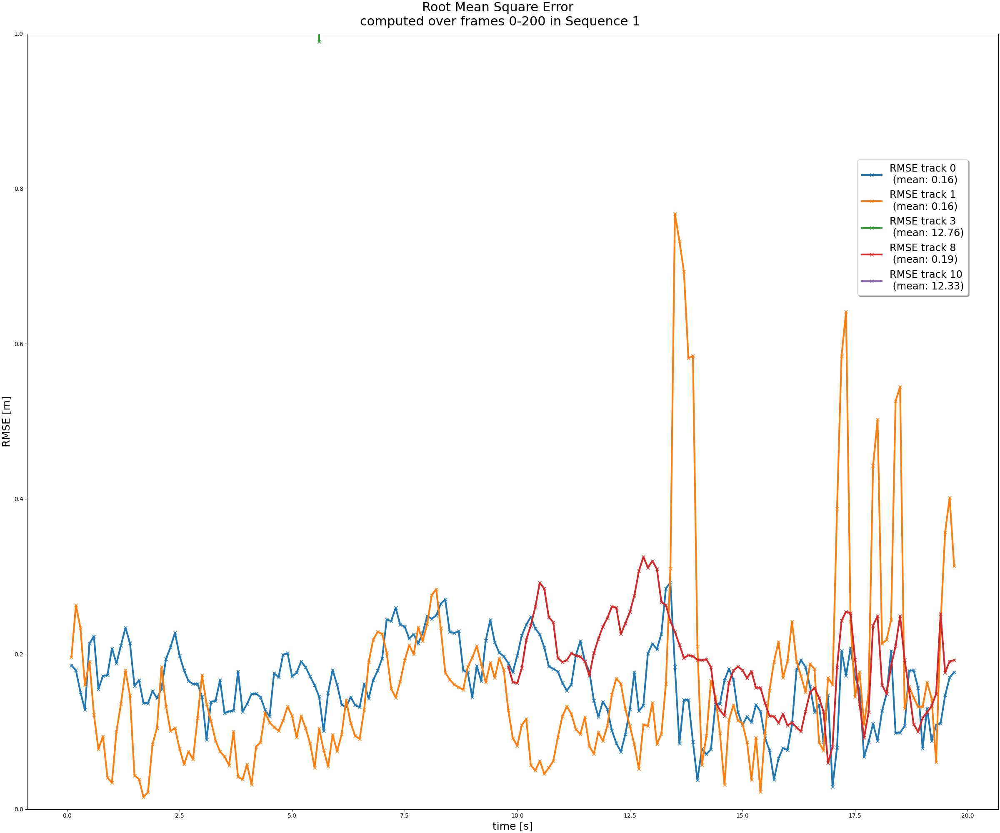

# Project 2.2: Multi-Target Tracking with Extended Kalman Filter
## Final Report
#### By Jonathan L. Moran (jonathan.moran107@gmail.com)
From the Self-Driving Car Engineer Nanodegree programme offered at Udacity.

## Introduction

In this project we applied our skills in sensor fusion and tracking to implement a system capable of tracking multiple vehicles over time using real-world driving data. Our multi-target tracking programme implements a Single / Suboptimal Nearest Neighbor (SNN) algorithm with validation gating as a runtime performance improvement. Required for this project was a strong understanding of both LiDAR and camera sensors and their coordinate frames used in the dataset. Coordinate transformations were performed at each step in the algorithm to convert between the various sensor and vehicle frames. Special attention was given to the RGB camera sensor, since it has a non-linear measurement model and therefore requires a more complex tracking and fusion algorithm to be implemented.  

In order to evaluate the results of our multi-target tracking programme, we extracted real-world 3D LiDAR detections and RGB images from the [Waymo Open Dataset](https://waymo.com/open) [1]. We wrote a mid-level sensor fusion module to combine these LiDAR measurements with the bounding box predictions we obtained from the inference run over our object detection net in [Project 2.1](https://github.com/jonathanloganmoran/ND0013-Self-Driving-Car-Engineer/tree/2-2-MTT-with-EKF/2-Sensor-Fusion/2-1-3D-Object-Detection-with-LiDAR-Data). Our early results suggest that the current version of the algorithm performs decently at the vehicle detection and tracking tasks. Ready to learn more? Let's get started!

## Extended Kalman Filter (EKF)

### Background
A major component of this project was the implementation of object tracking, i.e., the ability to detect and follow an object through consecutive frames in a video. An object tracking algorithm is able to perform this task by incrementally estimating the object position at each time-step through a process known as _filtering_. The [Kalman filter](https://en.wikipedia.org/wiki/Kalman_filter) is a popular probabilistic reasoning algorithm that provides estimates of an object's position by 'filtering' out noise due to e.g., measurement error or uncertainty. In a two-step process, the Kalman filter forms _predictions_ about the object's position and velocity (its state), then _updates_ these predictions using filtered sensor measurements. This _process_ is repeated at each time-step, and the Kalman filter recursively works out the "best guess" from only the last state estimate. The Kalman filter uses the [Markov process](https://en.wikipedia.org/wiki/Markov_chain#Discrete-time_Markov_chain) assumption such that the next prediction at time-step $t_{k}$ only depends on the information about the object state obtained at $t_{k-1}$.

### The non-linear assumption
The [extended Kalman filter](https://en.wikipedia.org/wiki/Extended_Kalman_filter) (EKF) is used in this project to handle the non-linear camera measurement function. The EKF linearises the measurement model $h\left(\mathrm{x}\right)$ using a multivariate [Taylor series](https://en.wikipedia.org/wiki/Taylor_series) expansion about the expansion point $\mathrm{x}$, i.e., the position estimate from the camera obtained at the given time-step. In order to use the EKF in our project, we assume that both the process and measurement noise follow a zero-mean [multivariate Gaussian](https://en.wikipedia.org/wiki/Multivariate_normal_distribution) distribution with covariance $\mathcal{Q}$ and $\mathrm{R}$, respectively. This project uses the [state-space representation](https://en.wikipedia.org/wiki/State-space_representation) to encode all information about a system in matrix form. The EKF allows us to compute the [Jacobian](https://en.wikipedia.org/wiki/Jacobian_matrix_and_determinant) of the camera measurement model in order to represent the measurement function $h\left(\mathrm{x}\right)$ as a matrix of partial derivatives. This essentially linearises the non-linear function about the current state estimate $\mathrm{x}$. 

### The prediction and update steps
We implement the two essential functions of the EKF — the _predict_ and the _update_ (or innovation / correction) steps, in the [`filter.py`](https://github.com/jonathanloganmoran/ND0013-Self-Driving-Car-Engineer/blob/cd84889d6711ff450d4b8306a741113b0faca50f/2-Sensor-Fusion/2-2-Multi-Target-Tracking-with-EKF/student/filter.py) file. In the prediction step, the state estimate $\mathrm{x}^{+}$ and the process noise covariance $\mathrm{P}^{+}$ are predicted into the next time-step. In the update step, we correct the prediction using an observation (a new measurement) received at time $t_{k}$. The measurement residual, $\gamma$, is computed in this update step, which compares the received measurement $\mathrm{z}$ to the previous state estimate $\mathrm{x}^{-}$. Here we transform the state estimate into measurement space using the measurement function $h\left(\mathrm{x}\right)$. Note that in this project we use the '$+$' notation to indicate a state variable that _has not_ been updated with a measurement, and the '$+$' notation for a state variable that _has_ been updated with the latest measurement.

The predict and update steps are run in a loop and are performed at each measurement time-step.

## Multi-Target Tracking (MTT)
In order to successfully track multiple objects over time, we need a tracking programme that implements several core modules. Those are: _data association_ and _track management_. In the _data assocation_ task, our programme assigns each incoming measurement to a new track instance. Here, a track refers to a variable which encapsulates a state estimate (position, velocity) and its covariances (i.e., a `Measurement` instance), together with a set of tracking attributes that describe the quality of the track prediction (i.e., a `Track` instance).

### Data Association
In the _data association_ module, all new measurements from either the LiDAR or camera sensor are assigned to a track. Here the data association algorithm decides whether a given measurement was generated from an existing track, or whether it represents a newly-detected track (e.g., a car that has just entered the scene). Using an _association matrix_, our algorithm assigns a track the closest measurement using the [Mahalanobis distance](https://en.wikipedia.org/wiki/Mahalanobis_distance)  — a distance measure between a measurement $\mathrm{z} = \left[p_{x}, p_{y} p_{z} \ldots \right]^{\top}$ and distribution $D$. Here the distribution we choose is the zero-mean Gaussian normal distribution given by the residual error covariance $\mathrm{S}$. This distribution results from the calculation of the residual, $\gamma$, which is essentially the weighted position estimate with respect to the position estimate $\mathrm{p}_{k}$ of the measurement and the process / measurement noise covariances. From this assumption we form a probability $p = \left(1 - \alpha\right)$ that the given true measurement lies outside the hyper-ellipse gate formed by the residual covariance $\mathrm{S}$. In short, we choose to implement the Mahalanobis distance measure over e.g., Euclidean distance, as it accounts for measurement uncertainty and therefore avoids less assignment errors. This can be observed in scenarios where two objects are close vicinity; one measurement may be incorrectly assigned to the wrong object with a Euclidean distance measure alone. However, with Mahalanobis distance, we factor in the object's position uncertainty. Therefore, we can assign the object to the measurement residing inside the region of uncertainty formed by the hyper-ellipsoid. Using this weighting factor, we avoid situations where minimising distance alone may not result in the correct assignment.   

In this project we choose to implement the Single / Suboptimal Nearest Neighbor (SNN) algorithm for the data association task. The core assumptions given by SNN are as follows: each track generates at most one measurement, and each measurement originates from at most one track. While this simplification reduces code complexity, it does not appropriately account for ambigious situations — such as for 'clutter' measurements (i.e., false positives) or for object tracks that were not detected in the given measurement time-step (i.e., false negatives). Lastly, we choose to implement a validation gating algorithm using the Mahalanobis distance and covariance distribution asusmptions that help us elliminate unlikely assignments to speed up the data association task.

### Track Management
In order to implement the multi-target tracking system, we must rely on a _track management_ module to not only initialise new tracks, but also delete old ones. Using a confidence measure incremented at each detection step, we can weight tracks that we feel confident about. For example, tracks who represent objects that are consistently detected will receieve a higher confidence score. On the other hand, tracks with a low confidence score represent objects that go often undetected across consecutive frames. This may occur for e.g., 'ghost' tracks that were created due to a 'clutter' (false positive) measurement. After some iterations later, this 'ghost' track should be eliminated because our confidence in it representing a real object is very low. We measure this confidence based on the number of times the object was detected in a window of the last $n$ frames. Using a very simple formula,

$$
\begin{align}
\textrm{track score} = \frac{\textrm{# of detections in last } n \textrm{ frames}}{n}, \\
\end{align}
$$

and a carefully selected $n$, we are able to eliminate these type of false positive tracks relatively quickly. As we have seen, a very important part of track management is the deletion step. Knowing when to delete tracks is not as trivial as it may seem, since objects in a driving scene can often exit the field of view only to reappear a few frames later (e.g., a nearby vehicle occluded due to direct sunlight temporarily blinding the sensor field of view).

The other important task of a track management module is the initialisation problem, as we cannot properly track any objects over time without first assigning them to a new track. In this project we use the LiDAR measurements exclusively to assign new objects to new tracks. This was decided based on the camera sensor's inability to rectify depth information in a single time-step. Without a three-dimensional estimate of position, our new track estimate would collapse over time, making the data association problem extremely difficult given the very high uncertainty about the third coordinate. Several techniques exist to address this problem, namely photogrammetry and other techniques involving [3D reconstruction from multiple images](https://en.wikipedia.org/wiki/3D_reconstruction_from_multiple_images), but that is beyond the scope of this project.

For complete coverage of the specific track management implementation used in this project, see [`2022-11-17-Course-2-Sensor-Fusion-Exercises-Part-3.ipynb`](https://github.com/jonathanloganmoran/ND0013-Self-Driving-Car-Engineer/blob/81b3a9eed386bd71d53f83931f0d5ff6c8ee497d/2-Sensor-Fusion/Exercises/2022-11-17-Course-2-Sensor-Fusion-Exercises-Part-3.ipynb). There you will find many formulas for both track initialisation (coordinate transforms and covariance initialisation), track scoring, and validation gating. 

## Sensor Fusion
Provided in the Waymo Open Dataset are camera feeds and LiDAR returns captured at five viewpoints surrounding the ego-vehicle. In this project, we perform [mid-level sensor fusion](https://www.thinkautonomous.ai/blog/9-types-of-sensor-fusion-algorithms/) using the 2D object detection labels from the RGB front-facing camera together with the 3D LiDAR returns captured by the top-mounted sensor. In order to make use of the data from two different sensor modalities, a set of coordinate transformations were performed. With each sensor having a defined sensor coordinate frame, we were able to translate the coordinates from the LiDAR sensor along the $x$-axis and rotate them about the $z$-axis of the ego-vehicle world frame. Unlike the LiDAR measurements, the RGB camera sensor captured spatial information in the image plane. Without stereo rectification on 3D reconstruction techniques, our option here was to instead convert the LiDAR measurements from the vehicle coordinate frame to the image frame via a projective transformation. Therefore, we were able to fuse the sensors' measurements in two dimensions while using the LiDAR sensor solely for depth estimation.

Many other techniques exist for low-level / early fusion of raw point cloud data and RGB image data, but due to code and computational complexity, we chose not to consider this route for now. 

## Results

### Extended Kalman Filter
#### Challenges
Initially, we obtained an RMSE score that was very high. This was due to the fact that our LiDAR sensor detections contain a systematic offset along the $y$-axis. The results we obtained were reflective of the fact that the zero-mean asusmption we made about the measurement error covariance $\mathrm{R}$ was not upheld in our real-world tests. Using sensor fusion, we were able to overcome this challenge by including other sensors (RGB camera) to compensate for this.

Another challenge we faced while designing the EKF was in regards to selecting optimal design parameters. With the current implementation we are afforded several parameters to experiment with, including the `delete_threshold` and the `max_P` values. These two parameters govern which tracks should be deleted when they have either a track score below, or an error covariance above, these respective values. We decided to utilise the values `delete_threshold = 0.6` and `max_P = 3**2` from inside [`params.py`](https://github.com/jonathanloganmoran/ND0013-Self-Driving-Car-Engineer/blob/cd84889d6711ff450d4b8306a741113b0faca50f/2-Sensor-Fusion/2-2-Multi-Target-Tracking-with-EKF/misc/params.py).

### Multi-Target Tracking
#### Challenges
Several challenges regarding the multi-target tracking task in dense target environments were observed.

The first challenge we faced was in regards to contentions, i.e., scenarios where multiple (two or more) neighbouring objects had generated a set of measurements which were in close proximity to each other. We needed to perform the data association task in a way that could optimally assign these measurements to the correct objects. Euclidean distance as a cost metric was first considered, but its downfalls became quickly realised in these ambigious scenarios. To mitigate contentions, we chose to implement Mahalanobis distance — a cost metric that weighs the residual covariance, i.e., position uncertainty, in the distance calculation. This resulted in an improved response of the data association algorithm to contentions in scenarios where measurements within an object's region of uncertainty (hyper-ellipse) were incorrectly assigned to a neighbouring object whose Euclidean distance was shorter than to the true object.

However, by utilising the Single / Suboptimal Nearest Neighbor (SNN) algorithm, we left room on the table — by independently assigning the 1-1 correspondence, we failed to account for scenarios where multiple objects' gating regions overlap. The SNN looks for these measurements within the gating region and makes an assignment by minimising the distance metric. In these complex situations, Mahalanobis distance with SNN is not enough. As a starting point, we suggest exploring the the [Global Nearest Neighbor](https://stonesoup.readthedocs.io/en/latest/auto_tutorials/06_DataAssociation-MultiTargetTutorial.html) (GNN) algorithm in order to find a globally-consistent collection of hypotheses such that an overall score of correct association is maximised. Such an algorithm will handle situations where one track "steals" the measurement of another, resulting in miscorrelation and track deletion [2]. 

Another downside of our current implementation is in regards to scalability. We compute for all measurements $N$ and all tracks $M$ a number $N\times M$ associations. Using a greedy approach, we select the track-measurement association with the lowest distance score from the permutation (association) matrix. This 1-1 correspondence problem will not perform well in real-time settings with an unoptimised algorithm. While algorithms such as the Kuhn-Munkres (i.e., [Hungarian algorithm](https://en.wikipedia.org/wiki/Hungarian_algorithm)) guarantee an optimal assignment, special attention must be given to optimising the computational complexity of these assignments in order for this data association module to be realised in real-time settings.

#### Improvements

In handling the case of _false alarms_, i.e., false positive 'clutter' measurements, we implement a track score via a weighting function calculated over the last $n$ detections. Using the track score we are able to eliminate tracks which had gone undetected for some number of detections without abruptly eliminating the tracks of true objects which had briefly left the field of view (i.e., missed detections). As mentioned above, we also implemented a validation gating function based on the covariance $\mathrm{S}$ based on the residual $\gamma$. This approach allowed us to eliminate unlikely assocations; with probability $p = \left(1 - \alpha\right)$ we could assume a given true measurement could be outside the gating region. Thus, we strict the assignment of object tracks to measurements only inside the gating region.

#### Results

##### Track management / Single-target tracking

$$
\begin{align}
\textrm{Figure 1. Track management — initialisation and deletion — evaluated on a sequence obtained from the Waymo Open Dataset.}
\end{align}
$$

Here we evaluate the results of the track management module, i.e., the track initialisation and deletion functionality. We restrict the viewing area of the LiDAR sensor to a region $\left[-15, 5\right]$ metres along the $y$-axis of the vehicle frame in order to focus solely on the oncoming vehicle to the left of the ego-vehicle. We see in Figure 2 the initialisation of a track and observe its state change from `'initialized'` to `'tentative'` and later `'confirmed'` as the vehicle spans multiple frames. We also see from the given plot on the left that — when the vehicle leaves the field of view, its measurement is no longer reported and consequently the track is removed.

##### Multi-target tracking

$$
\begin{align}
\textrm{Figure 2. Results of the multi-target tracking (MTT) programme evaluated on a sequence obtained from the Waymo Open Dataset.}
\end{align}
$$

The above results indicate that our tracking implementation functions as expected; multiple vehicles are successfully tracked across frames [0, 200] of Sequence 2 from the Waymo Open Dataset. As expected, 'ghost' tracks are quickly recycled (deleted) within several frames of being initialised. We observe that, with the fusion of camera and LiDAR data, 'initialised' object tracks converge to a 'confirmed' state (i.e., track score of $1.0$) at a much faster rate. This is due to the increase in the number of measurements per time-step.

### Sensor Fusion
#### Challenges
With designing a multi-modal sensor fusion algorithm came the challenges of fusing measurements from two different measurement models. With the LiDAR sensor, we obtained 6D measurement estimates $\mathrm{z} = \left[p_{x} p_{y} p_{z} v_{x} v_{y} v_{z} \right]^{\top}$, i.e., position and velocity in the three-dimensional vehicle frame. Whereas with the RGB camera sensor, we obtained 2D measurements, i.e., bounding box coordinate predictions in two-dimensional image space. With these differences we had to design a fusion system that could appropriately utilise each sensor without corrupting our estimates due to e.g., measurement error or uncertainty. The camera sensor inherintly is unable to rectify depth of objects in image space and therefore could not be relied on to form a coherent 3D position estimate. In contrast, the LiDAR sensor measurements provided us these estimates directly, which allowed us to _initialise_ new object tracks using the LiDAR measurements alone. Both sensor types provided us with coherent 2D position estimates which were used in the track _update_ step to refine our Kalman filter state estimations.

Another challenge of using multi-modal data was the need to construct many coordinate transformations, each designed with respect to the individual sensor and its placement on the ego-vehicle. Both the LiDAR and RGB camera sensor units placed around the Waymo vehicle had unique coordinate frames — each were rotated by an angle $\phi$ about the upward-facing $z$-axis of the vehicle. This meant that each sensor needed to be transformed from the sensor frame into the vehicle frame using a [transformation matrix](https://en.wikipedia.org/wiki/Transformation_matrix#Rotation_2). While the LiDAR sensor measurements were already in world coordinates, a translation was needed to rotate the 3D coordinates through an [azimuth correction](https://en.wikipedia.org/wiki/Azimuth#Polar_coordinate). In other words, we needed to centre the LiDAR sensor frames relative to the forward-facing $x$-axis of the ego-vehicle. Each LiDAR sensor frame was offset by an angle $\phi$ from the vehicle frame and therefore needed to be properly rotated before using the measurements. The camera measurements, on the other hand, were defined with respect to the 2D image frame. In order to fuse the LiDAR measurements with these 2D image coordinates, a transformation from vehicle-to-image frame was performed so that the LiDAR measurements in vehicle space could be appropriately associated with the camera detections in image space. Known as [camera resectioning](https://en.wikipedia.org/wiki/Camera_resectioning), this series of transformations involved projecting the 3D LiDAR coordinates from vehicle frame into image space using a _camera matrix_, i.e., the extrinsic calibration matrix defined by the camera's focal length and principal (centre) point. Note that the LiDAR estimates were augmented with a fourth coordinate $z_{4} = 1$ to form a [homogeneous coordinate](https://en.wikipedia.org/wiki/Homogeneous_coordinates) system. For more information on each sensor and its respective coordinate frame, see Sect. 1.2. of [`2022-11-11-Course-2-Sensor-Fusion-Exercises-Part-2.ipynb`](https://github.com/jonathanloganmoran/ND0013-Self-Driving-Car-Engineer/blob/81b3a9eed386bd71d53f83931f0d5ff6c8ee497d/2-Sensor-Fusion/Exercises/2022-11-11-Course-2-Sensor-Fusion-Exercises-Part-2.ipynb) and the original Waymo Open Dataset publication [1].

#### Results

$$
\begin{align}
\textrm{Figure 3. The Root Mean Square Error (RMSE) calculated from the Multi-Target Tracking (MTT) programme evaluated on a sequence from the Waymo Open Dataset.}
\end{align}
$$

## Closing Remarks
##### Alternatives
* Perform [3D reconstruction](https://en.wikipedia.org/wiki/3D_reconstruction#Monocular_cues_methods) using photogrammetric techniques e.g., [Structure from motion](https://en.wikipedia.org/wiki/Structure_from_motion) to estimate depth from monocular cues relative to the 2D motion of the ego-vehicle;
* Implement a more robust data association algorithm, e.g., [Probabilistic Data Association](https://en.wikipedia.org/wiki/Probabilistic_data_association_filter) or [Joint Probabilistic Data Association](https://en.wikipedia.org/wiki/Joint_Probabilistic_Data_Association_Filter) filters.

##### Extension of task
* Experiment with different values of `max_P`, the maximum measurement error noise covariance, in order to improve track deletion results;
* Use a non-linear motion model e.g., [Kinematic Bicycle Model](https://thomasfermi.github.io/Algorithms-for-Automated-Driving/Control/BicycleModel.html) to account for vehicle dynamics with steering rate $\phi$;
* Improve the object dimension estimates for width, length and height rather than using the unfiltered LiDAR detections as done in the current EKF implementation.

## Future Work
* ⬜️ Move to [Hydra](https://hydra.cc) or [`absl`](https://pypi.org/project/absl-py/) for model / dataset / environment parameter configuration;
* ⬜️ Fine-tune the tracking hyperparameters e.g., initial estimation error covariance values $\sigma$, to improve tracking RMSE;
* ⬜️ Implement a more robust data association algorithm e.g., GNN or PDA;
* ⬜️ Compare sensor fusion results to the ground-truth 2D-to-3D bounding box correspondence labels in the Waymo Open Dataset;
* ⬜️ Use the results of the tracking algorithm to perform path planning and motion estimation.

## Credits
* [1] Sun, Pei, et al. Scalability in Perception for Autonomous Driving: Waymo Open Dataset. arXiv. 2019. [doi:10.48550/ARXIV.1912.04838](https://arxiv.org/abs/1912.04838);
* [2] Konstantinova, P. et al. A Study of a Target Tracking Algorithm Using Global Nearest Neighbor Approach. CompSysTech '03: Proceedings of the 4th International Conference on Computer Systems and Technologies. Association of Computing Machinery. pp.290-295. 2003. [doi:10.1145/973620.973668](https://doi.org/10.1145/973620.973668).

Helpful resources:
* [`2022-11-11-Course-2-Sensor-Fusion-Exercises-Part-2.ipynb` by J. L. Moran | GitHub](https://github.com/jonathanloganmoran/ND0013-Self-Driving-Car-Engineer/blob/81b3a9eed386bd71d53f83931f0d5ff6c8ee497d/2-Sensor-Fusion/Exercises/2022-11-11-Course-2-Sensor-Fusion-Exercises-Part-2.ipynb);
* [`2022-11-17-Course-2-Sensor-Fusion-Exercises-Part-3.ipynb` by J. L. Moran | GitHub](https://github.com/jonathanloganmoran/ND0013-Self-Driving-Car-Engineer/blob/81b3a9eed386bd71d53f83931f0d5ff6c8ee497d/2-Sensor-Fusion/Exercises/2022-11-17-Course-2-Sensor-Fusion-Exercises-Part-3.ipynb);
* [`07-Kalman-Filter-Math.ipynb` by R. Labbe | GitHub](https://github.com/rlabbe/Kalman-and-Bayesian-Filters-in-Python/blob/master/07-Kalman-Filter-Math.ipynb);
* [Introduction to Data Association by B. Collins | Lecture Slides](https://www.cse.psu.edu/~rtc12/CSE598C/datassocPart1.pdf).
