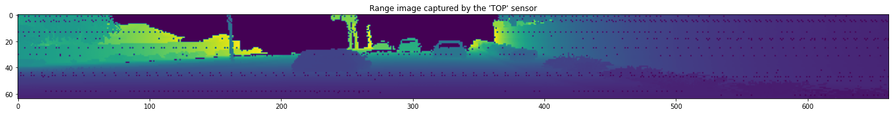
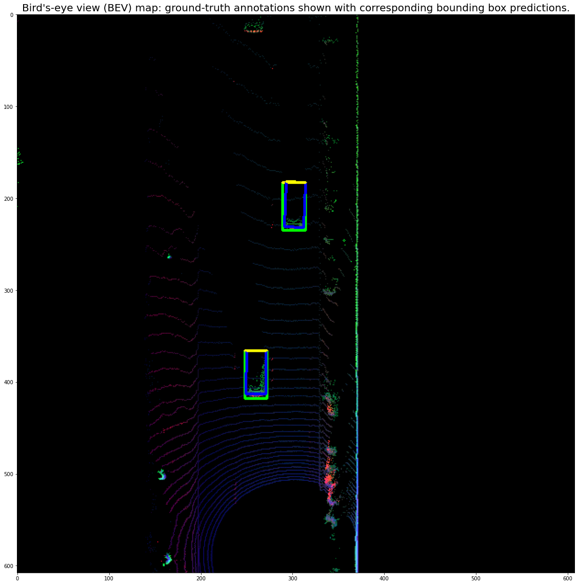
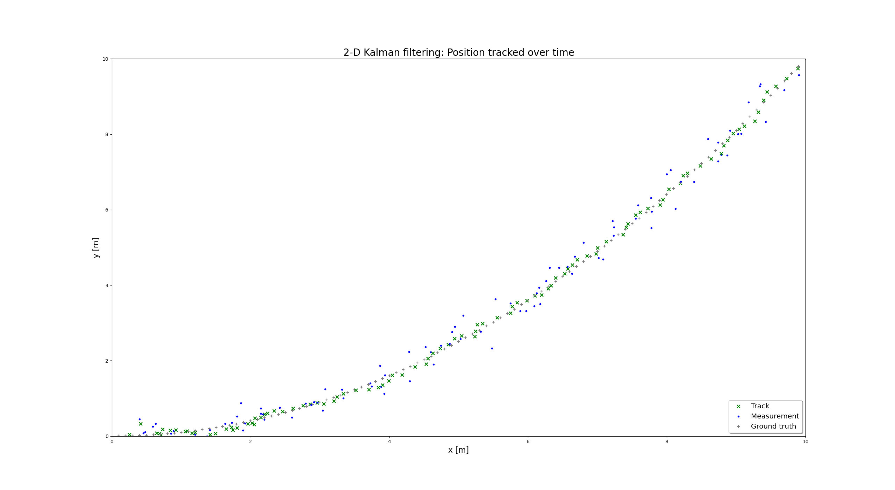
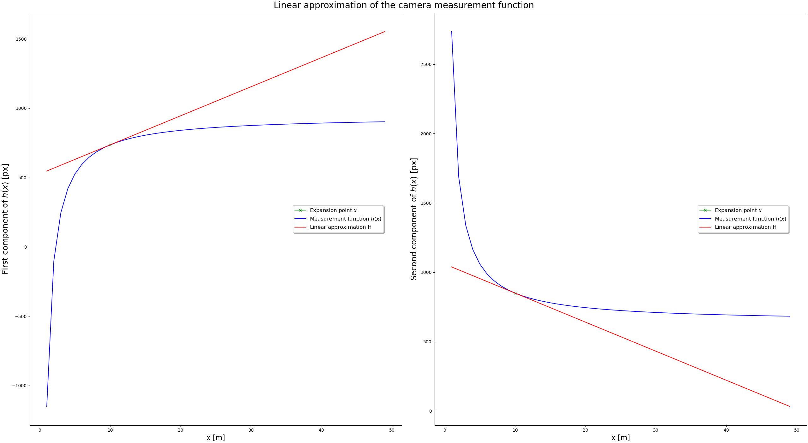

# Self-Driving Car Engineer Nanodegree
## Course 2: Sensor Fusion
### Part 1: Exercises
#### By Jonathan L. Moran (jonathan.moran107@gmail.com)
From the Self-Driving Car Engineer Nanodegree programme offered at Udacity.


## File Descriptions

Filename                                                                            | Description
------------------------------------------------------------------------------------|--------------
`setup.py`                                                                          | Sets the base directory and working path; used with `setuptools` to install project modules on build path.
`basic_loop.py`                                                                     | Entry point to the programme to run each exercise and example script.
`2022-10-20-Course-2-Sensor-Fusion-Exercises-Part-1.ipynb`                          | Jupyter notebook file demonstrating the Lesson 1 through Lesson 3 exercises of this course.
`2022-11-11-Course-2-Sensor-Fusion-Exercises-Part-2.ipynb`                          | Jupyter notebook file demonstrating the Lesson 4 through Lesson 6 exercises of this course.
`2-1-Lidar-Sensor/exercises/l1_exercises.py`                                        | Scripts to visualise the range images and print sensor statistics.
`2-1-Lidar-Sensor/examples/l1_examples.py`                                          | Scripts to load and convert range images to 3D point clouds; scripts to print additional sensor statistics.
`2-2-Object-Detection/exercises/l2_exercises.py`                                    | Scripts to load and convert 3D point clouds to BEV maps; evaluation metrics functions.
`2-2-Object-Detection/examples/l2_examples.py`                                      | Scripts to crop the point cloud to a ROI, render bounding boxes over BEV map images.
`2-3-Extended-Kalman-Filters/exercises/1_predict_update.py`                         | The 1-D Kalman `Filter` class and class methods required to perform 1-D tracking of objects with LiDAR data.
`2-3-Extended-Kalman-Filters/exercises/2_filter.py`                                 | The 2-D Kalman `Filter` class and class methods required to perform 2-D tracking of objects with LiDAR data.
`2-3-Extended-Kalman-Filters/exercises/3_measurements.py`                           | The `Camera` sensor class and class methods required to linearise the measurement model for use with Extended Kalman Filter (EKF).
`requirements.txt`                                                                  | List of project requirements and dependencies to install with `pip` via the `setuptools` script.
`references.bib`                                                                    | List of BibTeX-formatted references mentioned in the Jupyter notebook files.
`tools/`                                                                            | Set of submodules used as dependencies, e.g., the Simple Waymo Dataset Reader.
`misc/`                                                                             | Set of script files to modify the LiDAR sensor matrices, fetch the sensor and programme parameters, range images, object labels, etc.


## Setup and Installation

To configure the project directory, run
```python
pip install --editable {BASE_DIR}
```
where `BASE_DIR` points to the top-level project directory. All project modules and external dependencies will be installed automatically via the `setuptools` build script.

## Running the Code

### L1-L3: Object Detection with LiDAR Data
All functions from Lesson 1 through Lesson 3 are executable from inside the [`basic_loop.py`](https://github.com/jonathanloganmoran/ND0013-Self-Driving-Car-Engineer/blob/main/2-Sensor-Fusion/Exercises/basic_loop.py) script file. To run the programme, use the standard command-line execution inside the project directory as follows:

```python
python3 basic_loop.py
```

Inside this script file is a `while` loop that iterates over the individual frames in the specified segment file and applies the desired L1 / L2 / L3 functions.

To run any of the `exercises` or `examples` functions independently, use the [`2022-10-20-Course-2-Sensor-Fusion-Exercises-Part-1.ipynb`](https://github.com/jonathanloganmoran/ND0013-Self-Driving-Car-Engineer/blob/main/2-Sensor-Fusion/Exercises/2022-10-20-Course-2-Sensor-Fusion-Exercises-Part-1.ipynb) demo file.

### L4-L6: Tracking with Kalman Filters
All functions from Lesson 4 through Lesson 6 can be previewed in the [`2022-11-11-Course-2-Sensor-Fusion-Exercises-Part-2.ipynb`](https://github.com/jonathanloganmoran/ND0013-Self-Driving-Car-Engineer/blob/main/2-Sensor-Fusion/Exercises/2022-11-11-Course-2-Sensor-Fusion-Exercises-Part-2.ipynb) notebook file. 

To run any of the `exercises` independently, use the standard command-line execution, e.g.,

```python
python3 1_predict_update.py
```

in order to execute any of the scripts inside [`2-3-Extended-Kalman-Filters/exercises`](https://github.com/jonathanloganmoran/ND0013-Self-Driving-Car-Engineer/tree/main/2-Sensor-Fusion/Exercises/2-3-Extended-Kalman-Filters/exercises).


## Results

### L1-L3: Object Detection with LiDAR Data


$$
\begin{align}
\textrm{Figure 1. Range image from Waymo Open Dataset: visualising the intensity channel.}
\end{align}
$$



$$
\begin{align}
\textrm{Figure 2. BEV map converted from range image data: visualising the predicted and ground-truth bounding boxes.}
\end{align}
$$

### L4-L6: Tracking with Kalman Filters



$$
\begin{align}
\textrm{Figure 3. Kalman Filtering in 2-D: Tracking Object Position Over Time.}
\end{align}
$$



$$
\begin{align}
\textrm{Figure 4. Linear Approximations: The Camera Measurement Function.}
\end{align}
$$

## Credits

This assignment was prepared by Dr. Andreas Haja and Dr. Antje Muntzinger et al., 2021 (link [here](https://github.com/udacity/nd013-c2-fusion-starter)).

References
* [1] Sun, Pei, et al. Scalability in Perception for Autonomous Driving: Waymo Open Dataset. arXiv. 2019. [doi:10.48550/ARXIV.1912.04838](https://arxiv.org/abs/1912.04838).
* [2] Zhou, Q-Y, et al. Open3D: A Modern Library for 3D Data Processing. arXiv. 2018. [doi:10.48550/ARXIV.1801.09847](https://arxiv.org/abs/1801.09847).
* [3] Wojtanowski, J., et al. Comparison of 905 nm and 1550 nm semiconductor laser rangefinders’ performance deterioration due to adverse environmental conditions. Opto-Electronics Review, 22(3):183-190. 2014. [doi: 10.2478/s11772-014-0190-2](https://doi.org/10.2478/s11772-014-0190-2).
* [4] Burns, H. et al. System design of a pulsed laser rangefinder, Optical Engineering. 30(3):323-329. 1991. [doi:10.1117/12.55801](https://doi.org/10.1117/12.55801).
* [5] Lin, Tsung-Yi, et al. Focal Loss for Dense Object Detection, arXiv. 2017. [doi:10.48550/ARXIV.1708.02002](https://arxiv.org/abs/1708.02002).
* [6] Wang, C. et al. YOLOv7: Trainable bag-of-freebies sets new state-of-the-art for real-time object detectors. ArXiv. [doi:10.48550/ARXIV.2207.02696](https://arxiv.org/abs/2207.02696).
* [7] Simon, M. et al. Complex-YOLO: Real-time 3D Object Detection on Point Clouds. arXiv. 2018. [doi:10.48550/ARXIV.1803.06199](https://arxiv.org/abs/1803.06199).
* [8] Ali, W. et al. YOLO3D: End-to-end real-time 3D Oriented Object Bounding Box Detection from LiDAR Point Cloud. ArXiv. 2018. [doi:10.48550/ARXIV.1808.02350](https://arxiv.org/abs/1808.02350).
* [9] Chen, X. et al. Multi-View 3D Object Detection Network for Autonomous Driving. arXiv. 2016. [doi:10.48550/ARXIV.1611.07759](https://arxiv.org/abs/1611.07759).
* [10] Charles, R. Q. et al. Frustum PointNets for 3D Object Detection from RGB-D Data. arXiv. 2018. [doi:10.48550/ARXIV.1711.08488](http://arxiv.org/abs/1711.08488).

Helpful resources:
* [Marshall, W. K., et al. Received Optical Power Calculations for Optical Communications Link Performance Analysis. The Telecommunications and Data Acquisition Report. 42(87):32-40. 1986.](hhttps://ntrs.nasa.gov/citations/19870005900);
* [Photodetectors for LiDAR | Hamamatsu Photonics](https://www.hamamatsu.com/content/dam/hamamatsu-photonics/sites/documents/99_SALES_LIBRARY/ssd/Photodetector_lidar_kapd0005e.pdf);
* [LiDAR, Radar, and Cameras: Measuring distance with light in the automotive industry by Hamamatsu Photonics | YouTube](https://youtu.be/D5Hh8EuOD2Q);
* [Photomultiplier Tubes: Basics and Applications (3rd Ed.) | Hamamatsu Photonics](https://www.hamamatsu.com/content/dam/hamamatsu-photonics/sites/documents/99_SALES_LIBRARY/etd/PMT_handbook_v3aE.pdf);
* [ND0013 Course 2 Lesson 5 Lecture Videos by Dr. Antje Muntzinger | YouTube](https://www.youtube.com/playlist?list=PL6nu8g-5OMNgl_rtYmrGa-K4lkjcTJbL5) — highly recommend going through these! 😃;
* And a special thanks to Hélène Kodersdotter for helping me work out the units of LiDAR equations! 😊