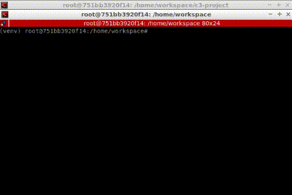

# Project 3.1: Scan Matching Localization
#### By Jonathan L. Moran (jonathan.moran107@gmail.com)
From the Self-Driving Car Engineer Nanodegree programme offered at Udacity.

## Objectives
* Immplement the [Iterative Closest Point](https://en.wikipedia.org/wiki/Iterative_closest_point) (ICP) and [Normal Distributions Transform](https://en.wikipedia.org/wiki/Normal_distributions_transform) (NDT) and algorithms to perform 3D scan matching in C++;
* Use the [CARLA Simulator](https://carla.org/) to test the algorithms with a simulated LiDAR sensor and ego-vehicle;
* Discuss strengths and weaknesses of either scan matching algorithms when applied to real-world driving data.

## 1. Introduction
In this final project of [Course 3: Localisation](https://github.com/jonathanloganmoran/ND0013-Self-Driving-Car-Engineer/tree/main/3-Localization), we implement two 3D scan matching algorithms in C++ in order to localise a simulated vehicle in the [CARLA Simulator](https://carla.org). The two scan matching algorithms selected for this project are the Iterative Closest Point](https://en.wikipedia.org/wiki/Iterative_closest_point) (ICP) and [Normal Distributions Transform](https://en.wikipedia.org/wiki/Normal_distributions_transform) (NDT). In this course we studied both algorithms in detail; in [Exercise 3.3.2](https://github.com/jonathanloganmoran/ND0013-Self-Driving-Car-Engineer/blob/main/3-Localization/Exercises/3-3-Scan-Matching/icp2-main.cpp) we wrote the ICP algorithm from scratch with a [Singular Value Decomposition](https://en.wikipedia.org/wiki/Singular_value_decomposition) (SVD) method [1] to estimate the parameters of a rigid transformation [1 - Sorokine]. In [Exercise 3.3.3](https://github.com/jonathanloganmoran/ND0013-Self-Driving-Car-Engineer/blob/main/3-Localization/Exercises/3-3-Scan-Matching/ndt-main.cpp) we wrote the NDT algorithm from scratch, implementing [Newton's method](https://en.wikipedia.org/wiki/Newton%27s_method_in_optimization) as defined in Biber et al., 2003 [2]. Here we use the implementation of these two algorithms provided in the [Point Cloud Library](https://en.wikipedia.org/wiki/Point_Cloud_Library) (PCL) to focus less on the algorithms themselves and more on their application to the localisation problem. Note that in this project we assume a [rigid transformation](https://en.wikipedia.org/wiki/Rigid_transformation) exists between two point clouds, and by registering the `source` to the `target` point cloud we can recover these translation and rotation components in order to form a 3D pose estimate from one vehicle location and orientation to the next.


## 2. Programming Task

### 2.1. Iterative Closest Point (ICP) for 3D Scan Matching

#### Background

The [Iterative Closest Point](https://en.wikipedia.org/wiki/Iterative_closest_point) (ICP) algorithm has been around for a long time — in 1992 Besl et al. [4] published their iterative method for 3D [point-set registration](https://en.wikipedia.org/wiki/Point-set_registration). Unsurprisingly, the ICP algorithm got its name as an iterative process which finds the closest point to each coordinate in a point set (i.e., a point cloud), minimising the mean-square distance between the two points at each step. ICP became a popular algorithm for estimating the rigid transformation between two point clouds with its ability to recover parameters in full six degrees of freedom (3D position plus 3D Euler angles, i.e., rotation). 

In this project we apply the [`pcl::IterativeClosestPoint`](https://pointclouds.org/documentation/classpcl_1_1_iterative_closest_point.html) to two 3D point clouds, an initial `source` scan and a transformed `target` scan capturing the change in pose of an ego-vehicle over a single time-step. Here we emphasize the ICP algorithhm's sensitivity to the initial registration set (i.e., the "initial guess" for the `target` transformation estimate). While the ICP is guaranteed to converge monotonically to a local minimum from any given rotation and translation of a data point set, it may or may not converge on the desired global minimum. To properly initialise our starting estimate, we assume a fixed starting pose at the origin. Given this we set our "initial guess" estimate to be the starting location of the ego-vehicle with position $\left(0, 0, 0\right)$ and form an initial estimate for the $4x4$ transformation matrix. In more complex scenarios, one should consider the equivalence classes for each shape of interest and compute a hypervoxel-based description for each. Since this is beyond the scope of this project, we will omit any concrete recommendations in that direction. 

In order to more-optimally search the set of nearest neighbours for each point, we form a [K-d tree](https://en.wikipedia.org/wiki/K-d_tree) structure by computing the centroids of the two point sets. From these centroids we calculate the relative distance from the centroid to each point, then perform a radius search with a thresholded distance query. In this project we unintuitively select a distance threshold of `5` metres, which is assumed to be the radius of the sphere bounding all centred vectors to the points neighbouring the points in `source`. Therefore, we use the [`pcl::KdTreeFLANN< PointT, Dist >::radiusSearch()`](https://pointclouds.org/documentation/classpcl_1_1_kd_tree_f_l_a_n_n.html) member function provided in PCL to complete this search over the restricted subset of nearest neighbours. This reduces our neighbour search from $\mathcal{O}\left(N\right)$ in worst-case to $\mathcal{O}\left(\log N\right)$, where $N$ is the total number of points in the `target` point cloud. In regards to the transformation estimate, we use the SVD algorithm to solve an [eigenvalue / eigenvector problem](https://en.wikipedia.org/wiki/Eigenvalue). In other words, the transformation of the distance vectors formed by each point-correspondence is estimated in three-dimensions. The solution to the matrix product decomposition is thus not just a scaling factor but a translation and rotation about the vector length _and_ direction. With SVD we derive a rotation that minimises the residual error (i.e., sum of square errors) between the registered point clouds.

It is also important to note that the ICP algorithm can be extended to $n$ dimensions by substituting the SVD algorithm for the quaternion algorithm [4][5]. In the case of the point correspondence problem, the "classic" ICP algorithm assumes a least-squares solution [4][5][6] where the optimiser minimises the average square error between pairings. In the non-linear case, the [Levenberg–Marquardt algorithm](https://en.wikipedia.org/wiki/Levenberg–Marquardt_algorithm) is used. For our use case, we choose to compute only the singular values of the Jacobi SVD decomposition matrix — we ask for only the _thin_ $\mathrm{U}$ or $\mathrm{V}$ in [`Eigen::JacobiSVD<MaxtrixXd, ComputeThinU | ComputeThinV`](https://eigen.tuxfamily.org/dox/classEigen_1_1JacobiSVD.html). In other words, this is equivalent to the least-squares solution with $\mathrm{U}$ given as a $n\times m$ and $\mathrm{V}$ as a $p\times m$ for rectangular $n \times p$ transformation matrix.

With this, we have introduced the ICP algorithm and covered most of the implementation overview from what was written in C++ code in [Exercise 3.3.2](https://github.com/jonathanloganmoran/ND0013-Self-Driving-Car-Engineer/blob/main/3-Localization/Exercises/3-3-Scan-Matching/icp2-main.cpp). Iterative Closest Point is therefore a fairly easy-to-understand, semi-computationally efficient local point-set matching algorithm that does not require pre-processing of the 3D point clouds (e.g., smoothing). However, we have learned that ICP is susceptible to initial pose estimates and gross statistical outliers. Its least-squares SVD [4][6] method (as well as the least-squares quaternion [5] approach) may also struggle to perform well (read: _fast_) in weighted assignment problems. In the context of self-driving vehicles, this may be a worthwhile point to consider. The ICP algorithm may produce suboptimal results since the uncertainties of the point estimates tend to increase with range. In this situation the ICP algorithm cannot be relied upon to produce coherent alignments and would consequently jepoardise object detection and tracking efforts needed to make self-driving decisions. Furthermore, certain driving scenarios are more likely to increase range uncertainty than others. For example, if the LiDAR scans were taken in low-light or extreme weather conditions, or if there are other objects occluding the field of view (via reflection and/or absorption), greater innacuracies in the range measurements may occur. Additionally, driving environments with significant terrain variation (i.e., drastic fluctuations in elevation) can lead to range measurement inaccuracies that pose a great challenge for the ICP algorithm. With this said, ICP may not be an optimal, robust choice when it comes to scan matching in real-world driving environments. To overcome some of these limitations, the author recommends exploring other algorithms, namely the feature descriptor / RANSAC-based Zhou et al., 2016 [Fast Global Registration](http://vladlen.info/papers/fast-global-registration.pdf) [7].

#### Results
The following output was produced during a test run of the localisation programme using ICP scan matching:


$$
\begin{align}
\textrm{Figure 1. Testing vehicle localisation in CARLA using the ICP scan matching algorithm.}
\end{align}
$$

#### Running and compiling the programme
To use the ICP algorithm in this project to perform scan matching, set line 43 inside [`c3-main.cpp`](https://github.com/jonathanloganmoran/ND0013-Self-Driving-Car-Engineer/blob/main/3-Localization/3-1-Scan-Matching-Localization/c3-main.cpp) to:
```cpp
/*** Defining the programme parameters ***/
// Define the scan matching / registration algorithm to use
// If `USE_ICP` is set to `false`, then the NDT algorithm will be used
const static bool USE_ICP = true;
```

Also configurable inside [`c3-main.cpp`](https://github.com/jonathanloganmoran/ND0013-Self-Driving-Car-Engineer/blob/main/3-Localization/3-1-Scan-Matching-Localization/c3-main.cpp) are several programme hyperparameters that affect the resolution of the generated point cloud map, as well as the LiDAR sensor parameters themselves. To start, we have:

```cpp
// Minimum distance of the LiDAR scan points to preserve (in metres).
// A LiDAR return must be at least this far away from the sensor origin
// in order to be preserved. All LiDAR points with a distance less than
// this threshold will be clipped (ignored). This is to prevent LiDAR
// returns from including points reflected off the ego-vehicle.
const static double kMinimumDistanceLidarDetections = 8.0;
// Maximum number of map scan points to store in memory.
// All scans recieved after this number of points have been stored
// will be ignored.
const static int kMaximumScanPointsMap = 5000;

/*** Setting voxel grid hyperparameters ***/
// Resolution of each 3D voxel ('box') used to downsample the point cloud
// Here we assume a cuboid, i.e., each of the sides (`lx`, `ly`, `lz`) have
// the same dimensions according to what is set here (in metres).
const static double kLeafSizeVoxelGrid = 0.5;
```

in addition to the attributes provided by the [`carla::client::Sensor`](https://carla.readthedocs.io/en/latest/ref_sensors/#lidar-sensor) `lidar::ray_cast` blueprint. These `attribute` values can be set manually inside the `SetLidarAttributes` function, or by selecting from the list of recommended values returned with the `GetRecommendedValues()` member function for each of the sensor attributes (not covered here).

##### Loading the input scans
In order to make use of this programme, you will need to have at minimum one map point cloud: the `map-loop.pcd` file. This file is provided to you in the Udacity workspace or in this repository. 

Note that any point cloud `.pcd` files should be placed in the root directory of the project. If you would like to store these files in a different directory, you must specify the path to the folder containing the files in the [`c3-main.cpp`](https://github.com/jonathanloganmoran/ND0013-Self-Driving-Car-Engineer/blob/main/3-Localization/3-1-Scan-Matching-Localization/c3-main.cpp) file. The path that you configure should be given relative to the current working directory, i.e., the `build/` path containing your executable. By default (for `.pcd` files in project root), we set the relative base path on line 45 to the following:

```cpp
// Set the base path relative to CWD where '.pcd' files are stored
const static std::string kBasePath = "../";
```

##### Setting the hyperparameters
The ICP algorithm has several termination criteria (labelled `1`-`3` inside [`c3-main.cpp`](https://github.com/jonathanloganmoran/ND0013-Self-Driving-Car-Engineer/blob/main/3-Localization/3-1-Scan-Matching-Localization/c3-main.cpp)) whose values, among the other ICP hyperparameters, can be configured. These are:
```cpp
/*** Defining the ICP hyperparameters ***/
// The maximum correspondence distance between `source` and `target`
// i.e., correspondences with higher distances will be ignored
// Should be sufficiently large s.t. all points are considered.
// Rule of thumb: set to max distance between two points in the point clouds.
const static double kMaxCorrespondenceDistanceICP = 5;  		// Metres (m)
// 1. The maximum number of ICP iterations to perform before termination.
// Should be large enough to ensure the algorithm has sufficient time to
// converge. Rule of thumb: set to twice the number of points in the PCL.
const static int kMaximumIterationsICP = 120;
// 2. The maximum epsilon threshold between previous transformation and current
// estimated transformation. Rule of thumb: set between 1e-4 and 1e-8.
const static double kTransformationEpsilonICP = 1e-4;
// 3. The maximum sum of Euclidean squared errors between two consecutive steps
// before algorithm is considered to be converged.
// Rule of thumb: set between 1 and 10.
const static double kEuclideanFitnessEpsilonICP = 2;
// The inlier distance threshold for the internal RANSAC outlier rejection loop
// Note: a point is considered an inlier if the distance between `target` and
// transformed `source` is smaller than inlier distance threshold.
// Default: 0.05m, Rule of thumb: set between 0.2 and 0.3 m.
const static double kRANSACOutlierRejectionThresholdICP = 0.2;  // Metres (m)
```

For a complete list of the available hyperparameters to tune for the ICP algorithm, see the [`pcl::IterativeClosestPoint` documentation](https://pointclouds.org/documentation/classpcl_1_1_iterative_closest_point.html).

##### Configuring CMAKE
To build the programme, set line 14 of the [`CMakeLists.txt`](https://github.com/jonathanloganmoran/ND0013-Self-Driving-Car-Engineer/blob/main/3-Localization/3-1-Scan-Matching-Localization/CMakeLists.txt) file to:

```cpp
set(sources {FILENAME OF MAIN} {FILENAME OF HELPERS})
```

where `{FILENAME OF MAIN}` should be `c3-main.cpp` and `{FILENAME OF HELPERS}` should be `helpers.cpp`.


##### Creating the executable
To build the programme with the configured [`CMakeLists.txt`](https://github.com/jonathanloganmoran/ND0013-Self-Driving-Car-Engineer/blob/main/3-Localization/3-1-Scan-Matching-Localization/CMakeLists.txt) file, first create a `build` folder inside the project root directory (here that is `c3-project/`) using the following command:

```console
root@foobar:/home/workspace/c3-project/# mkdir build
```

Then, navigate to inside the `build` folder and execute the `cmake` build script. You can do this with the following command:


```console
root@foobar:/home/workspace/c3-project/# cd build && cmake ..
```

##### Executing the programme
Once the programme has been compiled successfully, the executable can be run the following command:

```console
student@foobar:/home/workspace/c3-project/#  cd build && ./cloud_mapper
```

Note that if using the Udacity VM to run this programme, you will need to perform two extra steps before the executable can be run. 

First, set the superuser from `root` to `student` with the command:

```console
root@foobar:/home/workspace/c3-project/#  su - student
```

You may get a `Permission denied` error, but you can ignore this if you see the `student` user in the console command line as follows:

```console
student@foobar: ...
```

Now, with the `student` user account configured, navigate to the project root directory and run the following:

```console
student@foobar:/home/workspace/c3-project/#  ./run_carla.sh
```

This should set the CARLA Simulator to headless mode (i.e., disable graphics output) and prevent the programme from incurring any `Segmentation fault (core dumped)` errors.

To recap, here is a demonstration of the build / execute process:


$$
\begin{align}
\textrm{Figure 2. Building and executing the CARLA simulator and localisation programme on the Udacity VM.}
\end{align}
$$

##### Using the programme
In order to navigate the ego-vehicle inside the simulator, keyboard input is required. To move the vehicle forward, press the up-arrow key three times (once set the vehicle motion forward plus twice to set the vehicle throttle). To stop the vehicle, press the down-arrow key. Once the vehicle has made a complete stop, press the down-arrow key again to set the car to reverse. From there, use the up-arrow key 2x to increase the vehicle throttle and move the car backwards.

To control the steering angle of the vehicle, use the left- and right-arrow keys.

A demonstration of the programme with user input is shown below:


$$
\begin{align}
\textrm{Figure 3. Controlling the ego-vehicle in the CARLA simulator using the keyboard input.}
\end{align}
$$


### 2.2. Normal Distributions Transform (NDT) for 3D Scan Matching

#### Background
The [Normal Distributions Transform](https://en.wikipedia.org/wiki/Normal_distributions_transform) (NDT) algorithm performs 3D scan matching using a probabilistic approach. This algorithm pioneered by Biber et al., 2003 [2] was the first probabilistic method for [point-set registration](https://en.wikipedia.org/wiki/Point-set_registration) to achieve real-time performance. In this project we explore the effect of the initial estimates on registration accuracy, as well as hyperparameter values on the NDT's ability to localise the ego-vehicle over time. 

First let's briefly introduce the algorithm steps — in the setup phase, a [voxel grid](https://en.wikipedia.org/wiki/Voxel) is created to approximate the input point cloud (here, that is our pre-defined map point cloud). Each cell in the grid structure assumes that the given cluster of points from the point cloud follows a [normal distribution](https://en.wikipedia.org/wiki/Normal_distribution). With this assumption, the NDT assigns each point a probability value using the [probability density function](https://en.wikipedia.org/wiki/Probability_density_function) (PDF). In our from-scratch implementation of NDT in [Exercise 3.3.3](https://github.com/jonathanloganmoran/ND0013-Self-Driving-Car-Engineer/tree/main/3-Localization/Exercises/3-3-Scan-Matching), we combat the effect of discretisation by using a set of _overlapping_ cells to represent the cluster. The resulting probability values are used in the transformation estimate, which, through a [Newton's method](https://en.wikipedia.org/wiki/Newton%27s_method_in_optimization)-based optimisation, is iteratively maximised to yield the highest probability of two points being related. This optimisation process is repeated until the maximum likelihood of the transformation is achieved or until the maximum number of iterations is reached. This method is outlined in Biber et al., 2003 [2] and is refined by Magnussen et al., 2009 [3]. 

In our tests we observe the NDT struggle to localise the vehicle when significant pertubations to the vehicle's path are present. Additionally, The NDT algorithm is noticibly slower to converge than the ICP algorithm, averaging around 700ms per registration (versus <200ms with the ICP algorithm). Several things to note from these results is that the NDT algorithm is typically more sensitive to noise and outliers than ICP. NDT also seems to require more computational resources than ICP, which can lead to slower convergence times. Finally, we note that the NDT hyperparameters may not have been optimally configured in our experiments to achieve the desired accuracy and speed needed to keep up with the vehicle movement. The results of our experiments reflect the algorithm's sensitivity to hyperparameter configuration as well as its inability to handle environments with highly-dynamic objects.

#### Results
The following output was produced during a test run of the localisation programme using NDT scan matching:


$$
\begin{align}
\textrm{Figure 4. Testing vehicle localisation in CARLA using the NDT scan matching algorithm.}
\end{align}
$$


#### Running and compiling the programme
Note that configuring the programme to perform NDT involves changing only the value of a boolean flag initialised on line 43 inside [`c3-main.cpp`](https://github.com/jonathanloganmoran/ND0013-Self-Driving-Car-Engineer/blob/main/3-Localization/3-1-Scan-Matching-Localization/c3-main.cpp).
```cpp
// Define the scan matching / registration algorithm to use
// If `USE_ICP` is set to `false`, then the NDT algorithm will be used
const static bool USE_ICP = false;
```

**See Sect. 2.1. for all other build and execution steps.**

##### Setting the hyperparameters
The NDT algorithm has several hyperparameters whose values can be configured inside [`c3-main.cpp`](https://github.com/jonathanloganmoran/ND0013-Self-Driving-Car-Engineer/blob/main/3-Localization/3-1-Scan-Matching-Localization/c3-main.cpp). Of these, we experiment with the maximum allowed NDT iterations (`kMaximumIterationsNDT`) and the transformation step size (`kStepSizeNDT`). The number of maximum NDT iterations allowed before termination can be tweaked (i.e., increased) to yield more accurate transformation estimates at the expense of runtime performance. The transformation step size, which defines each step size taken during the optimisation process, can be tweaked (i.e., decreased) to yield more accurate transformation estimates at the expense of computational resources.   

After several experiment runs, we settled on a trade-off between the maximum allowed NDT iterations (`kMaximumIterationsNDT`), and the transformation step size (`kStepSizeNDT`). To combat poor convergence times, we reduced the number of NDT iterations allowed from `120` to `80`. However, this yielded poor localisation performance as the NDT algorithm was unable to localise the vehicle within a $1.0$ metre maximum distance error over a total distance of only 6 metres. Thus, we arrived at a `kMaximumIterationsNDT` of `95`. We also substantially decreased the step size, which increased convergence time but produced a more accurate transformation estimate. With the following configuration, we were able to push the vehicle to a distance of over 60 metres through several complex maneuvers before performance degraded beyond the $1.0$ metre max error.

```cpp
/*** Defining the NDT hyperparameters ***/
// The maximum number of NDT iterations to perform before termination.
// Each iteration the NDT algorithm attempts to improve the accuracy of the
// transformation. Default: 150, Rule of thumb: start with default and
// decrease or increase depending on size and complexity of data set.
const static int kMaximumIterationsNDT = 95;
// The step size taken for each iteration of the NDT algorithm.
// Used in the More-Thuente line search to determine how much the
// transformation matrix is updated at each iteration. A larger step size
//  will lead to faster convergence, but may lead to inaccurate results.
// Default: 0.1, Rule of thumb: decrease if NDT is coverging too quickly.
const static double kStepSizeNDT = 0.1;
// The transformation epsilon threshold for the NDT algorithm.
// The maximum epsilon threshold between the previous and current estimated
// transformation. Rule of thumb: set between 1e-4 and 1e-8.
const static double kTransformationEpsilonNDT = 1e-4;
// The resolution of the NDT `VoxelGridCovariance`
// i.e., the resolution side length of the 3D voxel to use for discretisation
// in the NDT algorithm. Here we assume a cubioid, i.e., each of the sides
// (`lx`, `ly`, `lz`) have the same dimensions according to what is set here.
const static double kVoxelGridCovarianceNDT = 1.0;
```

For a complete list of the available hyperparameters to tune for the NDT algorithm, see the [`pcl::NormalDistributionsTransform` documentation](https://pointclouds.org/documentation/classpcl_1_1_normal_distributions_transform.html).


## 3. Closing Remarks
##### Alternatives
* Use the quaternion algorithm to estimate the rotation parameters with the Iterative Closest Point (ICP) in $n$ dimensions;
* Evaluate the performance of a more-robust scan matching algorithm (e.g., Fast Global Registration [7]) on real-world data in difficult driving environments (e.g., uneven terrian, harsh weather conditions, occlusions, etc.).

##### Extensions of task
* Experiment with NDT hyperparameters to improve accuracy and reduce time to converge. 

## 4. Future Work
* ✅ Use extraction to move code outside `main` (i.e., create `SetActorsAndBlueprint`, `ProcessScan`, `UpdatePoseAndControl`, `UpdatePoseError` functions);
* ⬜️ Re-organise [`helpers.cpp`](https://github.com/jonathanloganmoran/ND0013-Self-Driving-Car-Engineer/blob/main/3-Localization/3-1-Scan-Matching-Localization/helpers.cpp) and [`helpers.h`](https://github.com/jonathanloganmoran/ND0013-Self-Driving-Car-Engineer/blob/main/3-Localization/3-1-Scan-Matching-Localization/helpers.h) such that the implementation and header files follow proper conventions
* ⬜️ Replace `auto` keyword declaration with explicit typing (note: [CARLA C++ API](https://carla.readthedocs.io/en/latest/ref_cpp/) uses templates and their own smart pointer implementation);
* ⬜️ Fine-tune the NDT algorithm hyperparameters.


## Credits
This project was prepared by A. Brown, T. Huang, and M. Muffert of the Mercedes-Benz Research and Development of North America (MBRDNA), 2021 (link [here](https://www.udacity.com/course/self-driving-car-engineer-nanodegree--nd0013)).


References
* [1] Sorokine-Hornung, O. et al. Least-Squares Rigid Motion Using SVD. Department of Computer Science, ETH Zürich. 2017. [PDF](https://igl.ethz.ch/projects/ARAP/svd_rot.pdf).

* [2] Biber, P. et al. The normal distributions transfom: a new approach to laser scan matching. Proceedings of the 2003 IEEE/RSJ Conference on Intelligent Robots and Systems (IROS 2003) (Cat. No.03CH37453). 3(1):2743-2748. 2003. [doi:10.1109/IROS.2003.1249285](https://doi.org/10.1109/IROS.2003.1249285).

* [3] Magnussen, M. et al. The three-dimensional normal-distributions transform: an efficient representation for registration, surface and loop detection. PhD thesis, Örebro universitet. Örebro Studies in Technology, 36(1):1-201. 2009. [URN:urn:nbn:se:oru:diva-8458](http://urn.kb.se/resolve?urn=urn%3Anbn%3Ase%3Aoru%3Adiva-8458).

* [4] Besel, P.J. et al. A method for registration of 3D shapes, IEEE Transactions on Pattern Analysis and Machine Intelligence. 14(1):239-254. 1992. [doi:10.1109/34.121791](https://doi.org/10.1109/34.121791).

* [5] Horn, B.K.P. et al. Closed-form solution of absolute orientation using unit quaternions. Journal of the Optical Society of America. 4(4):629-642. 1987. [doi:10.1364/JOSAA.4.000629](https://doi.org/10.1364/JOSAA.4.000629).

* [6] Umeyama, S. Least-Squares Estimation of Transformation Parameters Between Two Point Patterns. IEEE Transactions on Pattern Analysis and Machine Intelligence. 13(4):376-380. 1991. [doi:10.1109/34.88573](https://doi.ieeecomputersociety.org/10.1109/34.88573). 

* [7] Zhou, Q-Y. et al. Fast Global Registration. ECCV 2016. European Conference on Computer Vision. Lecture Notes in Computer Science, 9906:766-782. [doi:10.1007/978-3-319-46475-6_47](https://doi.org/10.1007/978-3-319-46475-6_47).


Helpful resources:
* [A Tutorial on Rigid Registration: Iterative Closest Point (ICP) by S. Elhabian et al. | Lecture Slides from University of Louisville](http://www.sci.utah.edu/~shireen/pdfs/tutorials/Elhabian_ICP09.pdf);
* [A Coversation with GPT on the Iterative Closest Point (ICP) algorithm in Self-Driving | OpenAI Playground](https://beta.openai.com/playground/p/znLUqlThNmuw2PwyceSH9M3S?model=text-davinci-003);
