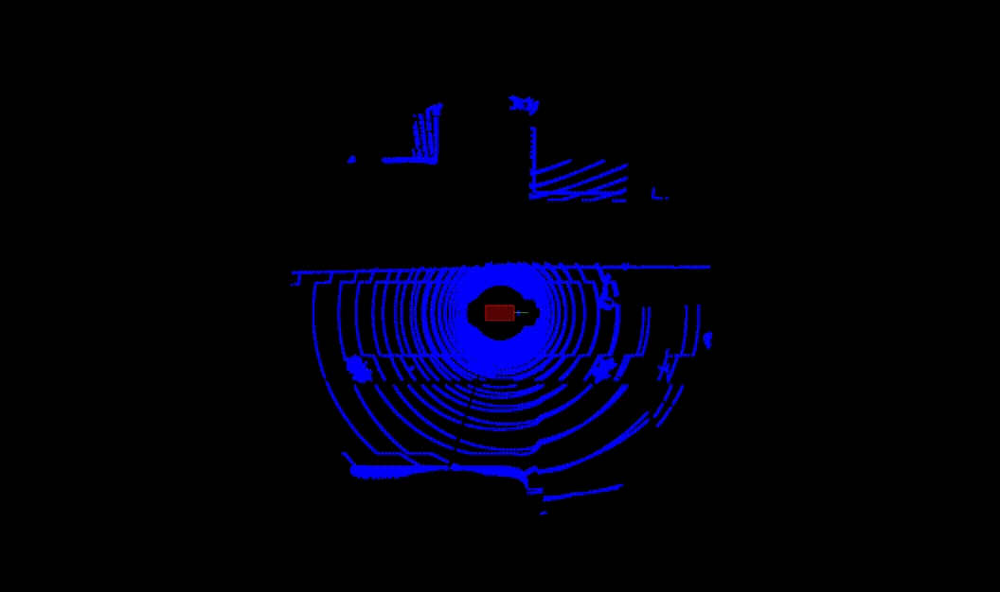

# Lesson 3.4: Utilizing Scan Matching
#### By Jonathan L. Moran (jonathan.moran107@gmail.com)
From the Self-Driving Car Engineer Nanodegree programme offered at Udacity.

## Objectives
* Immplement the [Iterative Closest Point](https://en.wikipedia.org/wiki/Iterative_closest_point) (ICP) and [Normal Distributions Transform](https://en.wikipedia.org/wiki/Normal_distributions_transform) (NDT) and algorithms to perform 3D scan matching in C++;
* Use the [CARLA Simulator](https://carla.org/) to perform mapping with a simulated LiDAR sensor.


## 1. Introduction
In this lesson we extend our work from [3.3: Scan Matching Algorithms](https://github.com/jonathanloganmoran/ND0013-Self-Driving-Car-Engineer/tree/main/3-Localization/3-3-Scan-Matching) to implement the ICP and NDT we learned in order to perform [point-set registration](https://en.wikipedia.org/wiki/Point-set_registration) in three dimensions. Here we make use of the [Point Cloud Library](https://en.wikipedia.org/wiki/Point_Cloud_Library) (PCL) to store and process the simulated LiDAR point cloud scans. We also use the [Eigen (C++ library)](https://en.wikipedia.org/wiki/Eigen_(C%2B%2B_library)) to perform 3D transformations over the point clouds using the pose information obtained from the vehicle. These three exercises utilise the PCL visualiser to render the point clouds, and also allow for interaction with the user via keyboard input. The user is able to enter a desired pose which is offset from the starting location of the vehicle. This offset pose is scanned by the simulated LiDAR and used to form a "source" cloud from which to align to the original reference location of the vehicle (referred to here as the "target" point cloud).

By visualising the results of the alignment at each iteration, the user is able to see the ICP or NDT algorithm in action as their offset location becomes "aligned" with the vehicle. In this activity the user is also able to compare the runtime performance of either algorithm, noticing how quickly either converges.

Finally, we apply our intuition of the scan matching algorithms to the [mapping](https://en.wikipedia.org/wiki/Robotic_mapping) problem, where the user is able to steer and accelerate a vehicle in a CARLA Simulator environment. The programme stitches together the simulated LiDAR scans after applying a vehicle-to-global coordinate frame transformation.Displayed visually is the resulting map as the vehicle explores its environment.

Sound exciting? Let's get started..

## 2. Programming Task

### 2.1. Iterative Closest Point (ICP) for 3D Scan Matching

#### Background
Similar to the previous lesson, we use the [Iterative Closest Point](https://en.wikipedia.org/wiki/Iterative_closest_point) (ICP) algorithm to estimate transformation between two point cloud scans. In this exercise, however, we allow the user to enter a desired offset position from the vehicle starting location. Using their keyboard, users can move the vehicle forward or backward with the right and left arrow keys, respectively. Users can also change the orientation of the vehicle heading along the $x$-axis using the `k` and `l` keys.

Once the user has configured their desired pose offset, a LiDAR point cloud "scan" is captured. The ICP algorithm uses this scan to iteratively align it with the original vehicle scan. Each transformation of the offset pose is visualised, where the user and view the vehicle move closer and closer to the original location and orientation of the vehicle.

##### Results
The following output was produced during a test run of the ICP algorithm:


$$
\begin{align}
\textrm{Figure 1. Testing the ICP registration with a manual starting offset.}
\end{align}
$$

#### Running and compiling the programme

##### Loading the input scans
In order to make use of this programme, you will need to have at minimum two point cloud files: the `map.pcd` and `scan1.pcd` files. These two files are provided to you in the Udacity workspace or in this repository. 

Note that these files should be placed in the root directory of the project. If you would like to store these files in a different directory, you must specify the path to the folder containing the files in the [`sm1-main.cpp`](https://github.com/jonathanloganmoran/ND0013-Self-Driving-Car-Engineer/blob/main/3-Localization/3-4-Utilizing-Scan-Matching/sm1-main.cpp) file. The path that you configure should be given relative to the current working directory, i.e., the `build/` path of your executable. We default to the following:

```cpp
// Set the number of `.pcd` files to load from CWD (starting from 'scan1.pcd')
const static int kNumInputScansToLoad = 1;
// Set the base path relative to CWD where '.pcd' files are stored
const static std::string kBasePath = "../";
```

where we indicate the path to the `.pcd` files relative to the CWD (here, that's inside the `/build/` subfolder). We also set the number of `scan` files to load to `1`, indicating that we want to load only the `scan1.pcd` file on start in the `LoadScans` function.


##### Setting the hyperparameters
Before you compile and run the programme, you may want to adjust the ICP algorithm hyperparameters. These hyperparameters control the convergence of the transformation, and therefore should be set cautiously. Any unreasonable values here might result in an insufficient transformation estimate.

We have inside the [`sm1-main.cpp`](https://github.com/jonathanloganmoran/ND0013-Self-Driving-Car-Engineer/blob/main/3-Localization/3-4-Utilizing-Scan-Matching/sm1-main.cpp) file:
```cpp
/*** Defining the ICP hyperparameters ***/
// The maximum correspondence distance between `source` and `target`
// i.e., correspondences with higher distances will be ignored
// Should be sufficiently large s.t. all points are considered.
// Rule of thumb: set to max distance between two points in the point clouds.
const static double kMaxCorrespondenceDistanceICP = 5;  		// Metres (m)
// The maximum number of ICP iterations to perform before termination.
// Should be large enough to ensure the algorithm has sufficient time to
// converge. Rule of thumb: set to twice the number of points in the PCL.
const static int kMaximumIterationsICP = 120;
// The maximum epsilon threshold between previous transformation and current
// estimated transformation. Rule of thumb: set between 1e-4 and 1e-8.
const static double kTransformationEpsilonICP = 1e-4;
// The maximum sum of Euclidean squared errors between two consecutive steps
// before algorithm is considered to be converged.
// Rule of thumb: set between 1 and 10.
const static double kEuclideanFitnessEpsilonICP = 2;
// The inlier distance threshold for the internal RANSAC outlier rejection loop
// Note: a point is considered an inlier if the distance between `target` and
// transformed `source` is smaller than inlier distance threshold.
// Default: 0.05m, Rule of thumb: set between 0.2 and 0.3 m.
const static double kRANSACOutlierRejectionThresholdICP = 0.2;  // Metres (m)
```

For a complete list of the available hyperparameters to tune for the ICP algorithm, see the [`pcl::IterativeClosestPoint` documentation](https://pointclouds.org/documentation/classpcl_1_1_iterative_closest_point.html).

##### Configuring CMAKE

To build the programme, set line 14 of the [`CMakeLists.txt`](https://github.com/jonathanloganmoran/ND0013-Self-Driving-Car-Engineer/blob/main/3-Localization/3-4-Utilizing-Scan-Matching/CMakeLists.txt) file to:

```cpp
set(sources {FILENAME OF MAIN} {FILENAME OF HELPERS})
```

where `{FILENAME OF MAIN}` should be `sm1-main.cpp` and `{FILENAME OF HELPERS}` should be `helpers.cpp`.

##### Creating the executable
To build the programme with the configured [`CMakeLists.txt`](https://github.com/jonathanloganmoran/ND0013-Self-Driving-Car-Engineer/blob/main/3-Localization/3-4-Utilizing-Scan-Matching/CMakeLists.txt) file, first create a `build` folder inside the project root directory using the following command:

```console
root@foobar:/home/workspace/# mkdir build
```

Then, navigate to inside the `build` folder and execute the `cmake` build script. You can do this with the following command:


```console
root@foobar:/home/workspace/# cd build && cmake ..
```

##### Executing the programme

Once the programme has been compiled successfully, run the executable with the following command:

```console
root@foobar:/home/workspace/# cd build && ./scan_matching_1
```

This will create a new PCL Viewer instance and render the map cloud together with the initial scan of the vehicle and a 3D bounding box to indicate its starting position. Using the left- and right-arrow keys, move the vehicle forward and backwards. Then, adjust the orientation angle using the `k` and `l` keys. Once you are satisfied with the position and orientation of the offset, start the ICP alignment with a press of the `i` key. Watch as your pose offset is transformed to the starting location and orientation of the vehicle! Pretty neat, huh?

Try to experiment with different offsets and observe the ICP algorithm results to see if it holds up to more extreme displacements. If you need to reset the vehicle offset to the starting position, press the `space` bar on your keyboard. 

The use of the ICP programme is demonstrated below:


$$
\begin{align}
\textrm{Figure 2. Using the ICP Programme: Demonstrating the keyboard interaction.}
\end{align}
$$


### 2.2. Normal Distributions Transform (NDT) for 3D Scan Matching

#### Background
Just like in the first exercise, we perform scan matching within an interactive viewer. The user is allowed to position the offset of the vehicle anywhere in the environment, and then observe the Normal Distributions Transform (NDT) algorithm iteratively estimate the transformation between the starting and the offset pose. What is surprising about this exercise is the speed at which the algorithm converges, that is, transforms the user offset pose to the original vehicle location. Here we observe the performance advantages of the NDT over the ICP algorithm, namely through the [voxel](https://en.wikipedia.org/wiki/Voxel) grid discretisation of the 3D space.

With the NDT algorithm, we only have to perform the "setup" for the alignment once. Afterwards, each successive iteration of the alignment process needs only to compute the updated probability distribution. In the initialisation step, the NDT uses the target point cloud (starting pose of the vehicle) to estimate a probability distribution over the discretised cells in the voxel grid. Each cell contains a set of LiDAR scan points whose probabilities sum to form a normal distribution. Once each probability distribution is estimated, the NDT only needs to update the probability values by re-parameterising the distributions. This requires a calculation of the mean and covariance w.r.t. the new estimate, but the voxelisation process is not required to be performed again.

##### Results

The following output was produced during a test run of the NDT algorithm:


$$
\begin{align}
\textrm{Figure 3. Testing the NDT registration with a manual starting offset.}
\end{align}
$$

#### Running and compiling the programme

##### Loading the input scans
In order to make use of this programme, you will need to have at minimum two point cloud files: the `map.pcd` and `scan1.pcd` files. These two files are provided to you in the Udacity workspace or in this repository. 

Note that these files should be placed in the root directory of the project. If you would like to store these files in a different directory, you must specify the path to the folder containing the files in the [`sm2-main.cpp`](https://github.com/jonathanloganmoran/ND0013-Self-Driving-Car-Engineer/blob/main/3-Localization/3-4-Utilizing-Scan-Matching/sm2-main.cpp) file. The path that you configure should be given relative to the current working directory, i.e., the `build/` path of your executable. We default to the following:

```cpp
// Set the number of `.pcd` files to load from CWD (starting from 'scan1.pcd')
const static int kNumInputScansToLoad = 1;
// Set the base path relative to CWD where '.pcd' files are stored
const static std::string kBasePath = "../";
```

where we indicate the path to the `.pcd` files relative to the CWD (here, that's inside the `/build/` subfolder). We also set the number of `scan` files to load to `1`, indicating that we want to load only the `scan1.pcd` file on start in the `LoadScans` function.


##### Setting the hyperparameters
Before you compile and run the programme, you may want to adjust the NDT algorithm hyperparameters. These hyperparameters control the convergence of the transformation, and therefore should be set cautiously. Any unreasonable values here might result in an insufficient transformation estimate.

We have inside the [`sm2-main.cpp`](https://github.com/jonathanloganmoran/ND0013-Self-Driving-Car-Engineer/blob/main/3-Localization/3-4-Utilizing-Scan-Matching/sm2-main.cpp) file:
```cpp
/*** Defining the NDT hyperparameters ***/
// The maximum number of NDT iterations to perform before termination.
// Each iteration the NDT algorithm attempts to improve the accuracy of the
// transformation. Default: 150, Rule of thumb: start with default and
// decrease or increase depending on size and complexity of data set.
const static int kMaximumIterationsNDT = 150;
// The step size taken for each iteration of the NDT algorithm.
// Used in the More-Thuente line search to determine how much the
// transformation matrix is updated at each iteration. A larger step size
//  will lead to faster convergence, but may lead to inaccurate results.
// Default: 0.1, Rule of thumb: decrease if NDT is coverging too quickly.
const static double kStepSizeNDT = 1.0;
// The transformation epsilon threshold for the NDT algorithm.
// The maximum epsilon threshold between the previous and current estimated
// transformation. Rule of thumb: set between 1e-4 and 1e-8.
const static double kTransformationEpsilonNDT = 1e-3;
// The resolution of the NDT `VoxelGridCovariance`
// i.e., the resolution side length of the 3D voxel to use for discretisation
// in the NDT algorithm. Here we assume a cubioid, i.e., each of the sides
// (`lx`, `ly`, `lz`) have the same dimensions according to what is set here.
const static double kVoxelGridCovarianceNDT = 1.0;
```

For a complete list of the available hyperparameters to tune for the NDT algorithm, see the [`pcl::NormalDistributionsTransform` documentation](https://pointclouds.org/documentation/classpcl_1_1_normal_distributions_transform.html).

##### Configuring CMAKE
To build the programme, set line 14 of the [`CMakeLists.txt`](https://github.com/jonathanloganmoran/ND0013-Self-Driving-Car-Engineer/blob/main/3-Localization/3-4-Utilizing-Scan-Matching/CMakeLists.txt) file to:

```cpp
set(sources {FILENAME OF MAIN} {FILENAME OF HELPERS})
```

where `{FILENAME OF MAIN}` should be `sm2-main.cpp` and `{FILENAME OF HELPERS}` should be `helpers.cpp`.

##### Creating the executable
To build the programme with the configured [`CMakeLists.txt`](https://github.com/jonathanloganmoran/ND0013-Self-Driving-Car-Engineer/blob/main/3-Localization/3-4-Utilizing-Scan-Matching/CMakeLists.txt) file, first create a `build` folder inside the project root directory using the following command:

```console
root@foobar:/home/workspace/# mkdir build
```

Then, navigate to inside the `build` folder and execute the `cmake` build script. You can do this with the following command:


```console
root@foobar:/home/workspace/# cd build && cmake ..
```

##### Executing the programme
Once the programme has been compiled successfully, run the executable with the following command:

```console
root@foobar:/home/workspace/# cd build && ./scan_matching_2
```

This will create a new PCL Viewer instance and render the map cloud together with the initial scan of the vehicle and a 3D bounding box to indicate its starting position. Using the left- and right-arrow keys, move the vehicle forward and backwards. Then, adjust the orientation angle using the `k` and `l` keys. Once you are satisfied with the position and orientation of the offset, start the NDT alignment with a press of the `n` key. Watch as your pose offset is transformed to the starting location and orientation of the vehicle! Pretty neat, huh?

Try to experiment with different offsets and observe the NDT algorithm results to see if it holds up to more extreme displacements. You can also compare the convergence time of the NDT to the ICP visually, or via the console logs.

The use of the NDT alignment programme is demonstrated below:


$$
\begin{align}
\textrm{Figure 4. Using the NDT Programme: Demonstrating the keyboard interaction.}
\end{align}
$$


### 2.3. 3D Mapping in CARLA Simulator

In this exercise we will be using the [CARLA Simulator](https://carla.org/) to perform mapping with a simulated LiDAR sensor. The process of [mapping](https://en.wikipedia.org/wiki/Robotic_mapping) involves iteratively stitching together LiDAR scans of the environment. In order to do this effectively, we use a transformation from sensor-to-vehicle and vehicle-to-world coordinate frames. We are able to perform the second transformation, i.e., from vehicle-to-world, in the CARLA Simulator since we know the vehicle's ground-truth pose at any given point in time. With this pose information we can properly stitch together the transformed point cloud scans, creating a detailed map consistent with the true perceived environment surrounding the vehicle. Let's get started!  

#### Results

The following was output produced during a test run of the mapping programme:



$$
\begin{align}
\textrm{Figure 5. Testing mapping in CARLA with user-entered vehicle control commands.}
\end{align}
$$


#### Running and compiling the programme

##### Loading the input scans
In order to make use of this programme, you will need to have at minimum two point cloud files: the `map.pcd` and `scan1.pcd` files. These two files are provided to you in the Udacity workspace or in this repository. 

Note that these files should be placed in the root directory of the project. If you would like to store these files in a different directory, you must specify the path to the folder containing the files in the [`map-main.cpp`](https://github.com/jonathanloganmoran/ND0013-Self-Driving-Car-Engineer/blob/main/3-Localization/3-4-Utilizing-Scan-Matching/map-main.cpp) file. The path that you configure should be given relative to the current working directory, i.e., the `build/` path of your executable. We default to the following:

```cpp
// Set the number of `.pcd` files to load from CWD (starting from 'scan1.pcd')
const static int kNumInputScansToLoad = 1;
// Set the base path relative to CWD where '.pcd' files are stored
const static std::string kBasePath = "../";
```

where we indicate the path to the `.pcd` files relative to the CWD (here, that's inside the `/build/` subfolder). We also set the number of `scan` files to load to `1`, indicating that we want to load only the `scan1.pcd` file on start in the `LoadScans` function.


##### Setting the hyperparameters
In this exercise you can configure the parameters of the simulated LiDAR sensor in order to observe the effect of scan resolution, and also simulate a desired LiDAR refresh rate.

In the [`map-main.cpp](https://github.com/jonathanloganmoran/ND0013-Self-Driving-Car-Engineer/blob/main/3-Localization/3-4-Utilizing-Scan-Matching/map-main.cpp) file, we have:

```cpp
/*** Defining the programme parameters ***/
// Maximum number of points to store in memory.
// All scans recieved after this number of points have been stored
// will be ignored.
const static int kMaximumScanPoints = 2000;
// Minimum elapsed time between scan intervals (in seconds).
// All new scans recieved before this many seconds has passed since
// the previous scan had been recieved will be discarded, i.e., the
// `scanPositions` vector will not be updated to include the new scan.
const static double kMinimumTimeBetweenScans = 1.0;
// Minimum distance of the LiDAR scan points to preserve (in metres).
// A LiDAR return must be at least this far away from the sensor origin
// in order to be preserved. All LiDAR points with a distance less than
// this threshold will be clipped (ignored). This is to prevent LiDAR
// returns from including points reflected off the ego-vehicle.
const static double kMinimumDistanceLidarDetections = 8.0;
// Minimum distance between the current pose and all existing scans
// A new pose must not have a distance to any of the existing scans
// less than this threshold.
const static double kMinimumDistanceBetweenScans = 5.0;
```

Here we advise you to adjust the maximum number of scan points to preserve in a given map (`kMaximumScanPoints`). This can be increased to yield a more detailed map, or, decreased to obtain better performance. We can also simulate a LiDAR sensor refresh rate by configuring the minimum allowed time between scans (`kMinimumTimeBetweenScans`). Setting this interval to something larger might improve performance but hinder the quality of the generated map at higher vehicle speeds. We can also simulate this effect by changing the minimum distance allowed between consecutive scans (`kMinimumDistanceBetweenScans`).   


##### Configuring CMAKE

To build the programme, set line 14 of the [`CMakeLists.txt`](https://github.com/jonathanloganmoran/ND0013-Self-Driving-Car-Engineer/blob/main/3-Localization/3-4-Utilizing-Scan-Matching/CMakeLists.txt) file to:

```cpp
set(sources {FILENAME OF MAIN} {FILENAME OF HELPERS})
```

where `{FILENAME OF MAIN}` should be `map-main.cpp` and `{FILENAME OF HELPERS}` should be `helpers.cpp`.

##### Creating the executable
To build the programme with the configured [`CMakeLists.txt`](https://github.com/jonathanloganmoran/ND0013-Self-Driving-Car-Engineer/blob/main/3-Localization/3-4-Utilizing-Scan-Matching/CMakeLists.txt) file, first create a `build` folder inside the project root directory using the following command:

```console
root@foobar:/home/workspace/# mkdir build
```

Then, navigate to inside the `build` folder and execute the `cmake` build script. You can do this with the following command:


```console
root@foobar:/home/workspace/# cd build && cmake ..
```

##### Executing the programme

Once the programme has been compiled successfully, the executable can be run the following command:

```console
student@foobar:/home/workspace/#  cd build && ./cloud_mapper
```

Note that if using the Udacity VM to run this programme, you will need to perform two extra steps before the executable can be run. 

First, set the superuser from `root` to `student` with the command:

```console
root@foobar:/home/workspace/#  su - student
```

You may get a `Permission denied` error, but you can ignore this if you see the `student` user in the console command line as follows:

```console
student@foobar: ...
```

Now, with the `student` user account configured, navigate to the project root directory and run the following:

```console
student@foobar:/home/workspace/#  ./run_carla.sh
```

This should set the CARLA Simulator to headless mode (i.e., disable graphics output) and prevent the programme from incurring any `Segmentation fault (core dumped)` errors.


$$
\begin{align}
\textrm{Figure 6. Building and executing the mapping programme using the Udacity VM.}
\end{align}
$$


With the above steps completed, you are now able to successfully run the compiled executable from inside the `build/` directory using the `./cloud_mapper` command. This will create a new CARLA viewer instance and render the map cloud together with the initial scan of the vehicle pose and a 3D rendering of the vehicle to indicate its starting position. Using the up-arrow key, increase the vehicle throttle (adjust its speed). Using a single press of the right-arrow key will stop the vehicle movement (i.e., reset the throttle to zero). If the down-arrow key is pressed while the vehicle is stationary, then the vehicle will be set to _reverse_. You may also adjust the heading of the vehicle (i.e., the orientation angle / direction) using the left- and right-arrow keys. The green line protruding the front of the vehicle represents the current steering angle. Once satisfied with the orientation, get the car moving with the up-arrow.

If you would like to reset the camera viewing angle, press the `a` key. This will re-centre the camera to a top-down orientation. You can also manually adjust the camera tilt using the left-click and drag mouse combination, or the camera pan using the scrollwheel click and drag motion. To zoom in, use the mouse scrollwheel in the desired direction.

After driving around a bit, you will have a decent representation of the environment. To save this map to a `.pcd` file, simply press the `a` key. This will exit the programme and write the map to the `my_map.pcd` file inside the project root directory. You may also specify another filename to save this map under by setting the `pclOutputFilename` on line 583 of [`map-main.cpp`](https://github.com/jonathanloganmoran/ND0013-Self-Driving-Car-Engineer/blob/main/3-Localization/3-4-Utilizing-Scan-Matching/map-main.cpp) from `my_map.pcd` to whatever you desire. Note that the `.pcd` extension must be included in the filename, and that in the current implementation any existing `my_map.pcd` files will be overwritten by successive calls to the `SavePointCloudToASCII` function.


The use of the mapping programme is demonstrated below:


$$
\begin{align}
\textrm{Figure 7. Using the mapping programme: vehicle controls with keyboard interaction.}
\end{align}
$$


## 3. Closing Remarks
##### Alternatives
* Use a more robust algorithm for scan matching (e.g., [global registration](http://www.open3d.org/docs/release/tutorial/pipelines/global_registration.html)).

##### Extensions of task
* Design / obtain other maps for use in the CARLA Simulator;
* Extract data from the CARLA Simulator to perform [Simultaneous Localisation and Mapping](https://en.wikipedia.org/wiki/Simultaneous_localization_and_mapping) (SLAM).

## 4. Future Work
* ⬜️ Use a different map in the CARLA Simulator;
* ⬜️ Perform localisation and mapping using data extracted from the CARLA Simulator.

## Credits
This lesson was prepared by A. Brown, T. Huang, and M. Muffert of the Mercedes-Benz Research and Development of North America (MBRDNA), 2021 (link [here](https://www.udacity.com/course/self-driving-car-engineer-nanodegree--nd0013)).

References
* [1] Biber, P. et al. The normal distributions transfom: a new approach to laser scan matching. Proceedings of the 2003 IEEE/RSJ Conference on Intelligent Robots and Systems (IROS 2003) (Cat. No.03CH37453). 3(1):2743-2748. 2003. [doi:10.1109/IROS.2003.1249285](https://doi.org/10.1109/IROS.2003.1249285).

* [2] Magnussen, M. et al. The three-dimensional normal-distributions transform: an efficient representation for registration, surface and loop detection. PhD thesis, Örebro universitet. Örebro Studies in Technology, 36(1):1-201. 2009. [URN:urn:nbn:se:oru:diva-8458](http://urn.kb.se/resolve?urn=urn%3Anbn%3Ase%3Aoru%3Adiva-8458).