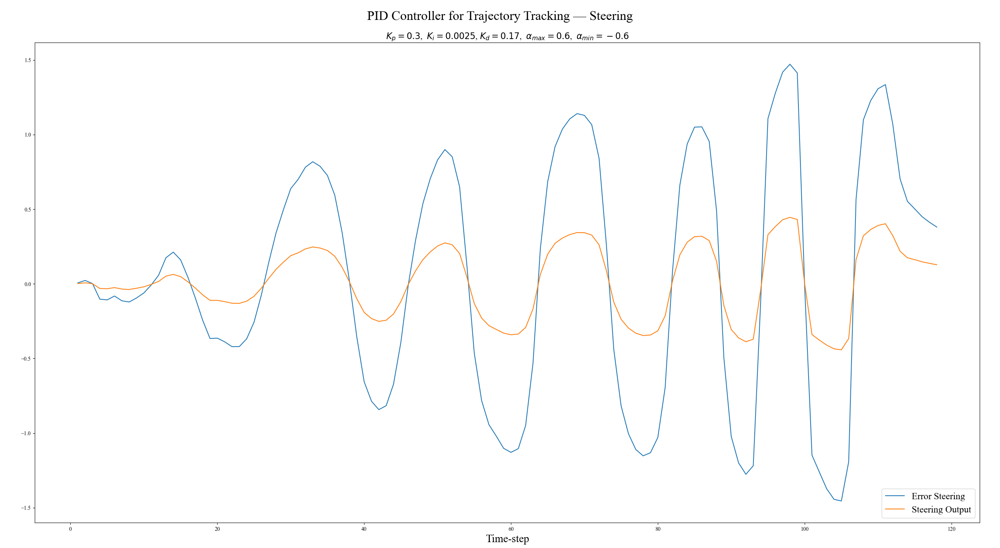
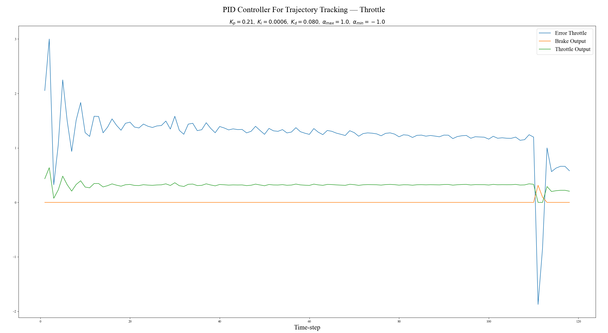

# Project 5.1: Control and Trajectory Tracking
## Project Submission Q&A
#### By Jonathan L. Moran (jonathan.moran107@gmail.com)
From the Self-Driving Car Engineer Nanodegree offered by Udacity.

## Objectivs
* Answer the following discussion questions Q1-Q5.

## Discussion Q&A
### Q1. Add the plots to your report and explain them (describe what you see).
A1. See [`figures/`](https://github.com/jonathanloganmoran/ND0013-Self-Driving-Car-Engineer/tree/main/5-Control/5-1-Control-Trajectory-Tracking/figures) folder for results and [`README.md`](https://github.com/jonathanloganmoran/ND0013-Self-Driving-Car-Engineer/blob/main/5-Control/5-1-Control-Trajectory-Tracking/README.md) for discussion of results (summarised below):

> 
>
> In the final experiment run I used the following PID controller gain values:
> ```cpp
> pid_throttle.init_controller(0.21, 0.0006, 0.080, 1.0, -1.0);
> pid_steer.init_controller(0.3, 0.0025, 0.17, 0.60, -0.60);
> ```
> This resulted in a collision-free trajectory which moved the ego-vehicle towards the goal location (the stop sign) without incurring significant error (as shown in the error plots). In order to arrive at these parameter values, I initially started with a uniform initialisation of gain values set at `1.0`. This resulted in a rapid steering / acceleration of the ego-vehicle which quickly ended in a collision:
> 
>
> Then, I decided to test out the parameter value recommendations I came across in [this Knowledge forum post](https://knowledge.udacity.com/questions/939702) by the Udacity Mentor Neha. These values were:
> ```cpp
> pid_throttle.init_controller(0.29, 0.0011, 0.3, 1.0, -1.0);
> pid_steer.init_controller(0.21, 0.0009, 0.1, 1.2, -1.2);
> ```
> While the ego-vehicle was able to avoid a collision for a bit longer than the initial run, I was still observing a trajectory that had both erratic steering and collisions. In order to arrive at the final set of parameter values, I manually adjusted first the proportional-term gain. After observing an error plots, I then adjusted the derivative-term gain values. Finally, the integral-term gains were adjusted in order to prevent the ego-vehicle from colliding with the last vehicle (the Citronen) at the end of the road.
>
> It is also important to note that in the final set of parameter values I have chosen to modify the maximum and minimum output thresholds (the last two arguments to `PID::init_controller, i.e., `lim_max_output`, `lim_min_output`) for the steering output response. This was an intentional decision first made by Marcus Vinicius which I discovered in [this Knowledge forum post](https://knowledge.udacity.com/questions/941131). The logic behind this decision is that the initial steering threshold value of $\pm1.2 \mathrm{rad} \sim \pm68.75^{\circ}$ was not represented of a true vehicle's turning radius. Given the information presented in the paper by Berjoza 2008, we settled on a more reasonable steering threshold value of $\pm0.6 \sim \pm 35^{\circ}$ which approximates the lower-end of the suggested range of the theoretical turning radius of a vehicle — $[\pm35^{\circ}, \pm45^{\circ}]$. After making this change we observe a lower collision rate, and, after tuning the parameters to their final experimental values, we observe a collision-free trajectory.

### Q2. What is the effect of the PID according to the plots? How does each part of the PID effect the control command?
A2. See commentary from the [`README.md`](https://github.com/jonathanloganmoran/ND0013-Self-Driving-Car-Engineer/blob/main/5-Control/5-1-Control-Trajectory-Tracking/README.md) (reproduced below):

> 
>
> In the first figure — the plot of the steering command data, the ego-vehicle exhibits sharp steering commands. This is observed in the plot as the sharp oscillations (high peaks / low valleys). Demonstrated is the back-and-forth (erratic) steering of the ego-vehicle performed in order to avoid collision. The PID controller design choice to clip the minimum / maximum steering allowed from $\pm 1.2 \mathrm{rad}$ to $\pm 0.6 \mathrm{rad}$ does not seem to prevent extremely sharp transitions between left- and right- angled steering commands, nor does it seem like the final controller gain values selected here help minimise the overall steering error experienced by the ego-vehicle with respect to the reference trajectory (the "best" polynomial spiral selected for each manoeuvre). 
>
> The choice of PID controller gain values for the steering response were selected such that the largest penalty (weight) was given to the proportional- term, since we wanted to keep the ego-vehicle roughly aligned with the curvature of the intended goal trajectory in order to avoid obstacles in the expected amount of time. The next-largest weight was given to the derivative- term in order to keep the steering response values within reasonable limits (i.e., penalise extremely abrupt changes to the steering angle). The least amount of weight was given to the integral- term, which attempts to penalise the cumulative uncorrected steering error in a consecutive time interval. This might be one area of weakness in the current implementation, where a large cumulative error w.r.t. steering might be apparent. In other words, if we decided to penalise larger cumulative errors more, we might notice a smoother steering trajectory, rather than just penalising large derivative errors (i.e., sharp changes in steering angle).   
>
> 
>
> In the second figure — the plot of the throttle command data, the controller error seems to stabilise to a [steady-state](https://en.wikipedia.org/wiki/Steady_state) after the initial [rise time](https://en.wikipedia.org/wiki/Rise_time) (as indicated by the sharp oscillations in the early part of the experiment run). While the controller maintains a relatively large magnitude of error throughout the experiment run, we notice a gradual downward trend of the throttle error (blue) towards the centre-line (red) at $y = 0$. This leads one to believe from the overall throttle response that this PID controller is more effectively tuned than the steering angle controller above.
>
> The parameters of the PID controller for the throttle commands were selected such that the largest weight was given to the proportional- term. This was to ensure that the throttle response was no greater than the intended throttle from the reference trajectory (i.e., a larger proportional-gain value means a greater penalty for _actual_ throttle commands that differ greatly from the _expected_). The next-largest gain value was chosen for the derivative- term, which was set such that the change in throttle was minimal. This was designed to give a more comfortable ride experience for the passenger(s) while keeping vehicle acceleration within theoretical / feasible limits. Lastly, the gain for the integral- term was given the least weight since the expected acceleration or braking were assumed to happen in relatively short intervals. With this assumption, there would be less chance of accumulating a large error over a great period of time $\Delta t$ which yields a less-significant contribution of error from this integral- term.

Furthermore, information from [this](https://robotics.stackexchange.com/a/9787) forum discussion by user Andy is reproduced below:
> * The proportional term — controls how quickly to turn the steering when the heading is not at the set value;
>    * A low $P$ value will lead to sluggish steering, reacting only slowly to set heading changes. It may never reach the commanded value;
>    * A higher $P$ value will give a snappier response, ideally with the steering turning rapidly and smoothly to follow commanded heading changes;
>    * Too high a $P$ value is an important case. If off-course by a small amount to the left, a large right-turn command will be issued. Too much $P$ value will give steering that weaves alternately left and right, overshooting the required heading, though it may eventually settle if the commanded course remains straight;
>    * An even higher $P$ value will lead to exaggerated oscillations and possibly shaking / vibration depending on the dynamics of the system, how heavy it is, how flexible the tyres and road surface are;
> * The derivative term — can be used to limit the speed of the steering response;
>    * Assuming a $P$ value coarsely set in a sensible range, this $D$ value serves to **reduce the speed of** the steering response when the error is changing rapidly;
>    * If the $P$ term is set high and overshoot or oscillation is occuring, adding derivative- action will limit the amount of hard turning done for large steering commands;
>    * In other words, increasing the $D$ term will reduce the maximum "sway" performed by the steering. Ideally, this will serve to reduce overshoot. If the $P$-controller is tuned too high, the right amount of derivative- action should stop oscillation;
>    * Too much derivative- action will probably become sluggish in steering again;
> * The integral term — adds more steering action if the error persists for too long;
>    * If the existing $P$ and $D$ control terms lead to an overall response that settles short of the required heading, an $I$ term will slowly add a steering command to edge closer (in theory);
>    * Too much integral- action can again cause overshoot / weaving, as the added integral- action turns in the correct way to get onto the commanded heading, but continues to steer because the large $I$ term effectively has a long memory of steering in that direction, i.e., it will take a while for the integrated error to reduce and straighten up again.
>
> The common advice often given for most systems is to increase the proportional- setting until performance is desirable. If you have to increase it so far that overshoot occurs (e.g., weaving in steering), then start to add small amounts of derivative- action to stop the overshoot. Then, add more $P$ and $D$ to get better performance. If you notice a state where the controller steers towards the centre but slows before getting there, add small amounts of $I$, but not so much that weaving starts again.

In summary, values of proportional- gain that are too low will lead to sluggish steering, while values that are too high may cause overshoot and oscillations. The derivative- gain can be used to limit the speed of the steering response and reduce the maximum "sway" performed. The integral- gain term can be used to add more steering action if the error persists for too long (memory), but too much can cause overshoot / weaving. Tuning should also be adjusted for the system dynamics such as weight, flexibility of tyres, road surface, etc. 

Another source of information covering this topic is [this YouTube video](https://youtu.be/4Y7zG48uHRo) by the MIT Aerospace Controls Lab. Some of those findings are summarised below:
* A proportional-only controller may not properly account for vehicle- or environment dynamics (e.g., curved heading, curved roads lead to underdamped behaviour, i.e., further oscillations of the steering angle);
* Increasing the proportional- gain is thought of as increasing the "pull" the vehicle feels towards the desired trajectory, whereas derivative- gain increases the resistance the vehicle feels against moving too quickly towards the reference trajectory;
    * The proportional- and derivative- gain values must be set in tandem;
* If the derivative- gain value is set too low, steering response might exhibit underdamped behaviour (oscillations), while a value set too high might result in an overdamped steering response (slow to correct for offsets);
    * An optimal derivative- gain value allows the system to reach the reference quickly with a zero steady-state error (i.e., critically damped).
* Integral- gain can help account for environmental factors (e.g., very strong cross-winds), or manufacturing defects that change the vehicle's nominal behaviour;
    * A sudden lane-offset will cause a zero-heading trajectory to build up a steady-state error;
    * The integral- gain penalises steering errors that exist primarily on one side or the other of a reference trajectory;
    * If the integral- gain value is set too low, steering response might exhibit overdamped behaviour (slow to correct for offsets), while a value set too high might result in an underdamped steering response (oscillations).

### Q3. How would you design a way to automatically tune the PID parameters?
A3. Discussed below:

In order to optimally-tune this PID controller, one may implement a parameter optimisation method. Akin to the Twiddle algorithm from this Lesson, we can implement an iterative local hill-climbing algorithm to gradually change each parameter of the PID controller until a more-optimal error rate is returned. With this said, we chose to neglect this step due to time constraints and many recommendations on Knowledge forum posts suggesting that this feat was not yet accomplished nor readily understood by the Mentors.

### Q4. PID controller is a model-free controller, i.e. it does not use a model of the car. Could you explain the pros and cons of this type of controller?
A4. Discussed below:

This type of controller is a model-free controller and therefore does not factor in the vehicle dynamics into the system response (i.e., the throttle and steering command outputs). Because of this limitation, vehicle kinematics and physical limitations with respect to gravity, acceleration are not considered. By incorporating knowledge of the vehicle wheel-body dynamics and past / predicted future performance over the experiment run, maximum acceleration rate, maximum turning rate, etc. we might be able to design a more-effective controller able to handle ambiguous situations (e.g., unprotected right-turn at intersection with oncoming traffic).

Pros:
* PID controller is easy to understand, easy to implement (no knowledge of the system needed);
* PID controller is widely-used in industry, widely-studied in academia;
* PID controller is easy to maintain (i.e., modify the parameters).

Cons:
* PID controller does not take into account the system / process (i.e., environment / vehicle dynamics);
* PID controller parameter tuning is less of a science than an art (i.e., discovering optimal values is more or less done through [trial-and-error](https://en.wikipedia.org/wiki/Trial_and_error));
* PID controller cannot easily handle complex scenarios (e.g., sharp right-turns);
* PID controllers are limited in their ability to handle high-dimensional nonlinear equations of motion that are characteristic of self-driving vehicles.

Due to the nonlinear nature of the vehicle motion equations used in the driving scenario, the PID controller often leads to poor performance and inaccurate trajectory tracking. Since the PID controller relies heavily on the initial setpoint, i.e., the desired trajectory of the vehicle, it is unable to cope with sudden changes in the environment when large disturbances are introduced. PID controllers are unlikely to predict quickly or accurately enough what the vehicle should do in these situations. Therefore, PID controllers ultimately exhibit a lack of robustness in the self-driving car domain and cannot be used reliably in environments with highly-varying dynamics (e.g., when vehicle is operating on a curved road).


### Q5. (Optional) What would you do to improve the PID controller?
A5. Discussed below:

As mentioned in A4, the nature of the PID controller does not take into account vehicle- or environment dynamics, nor does it make predictions about the future time horizon (i.e,. ego- or neno-ego actor behaviour over time). In order to make slight improvements to the PID controller, we set a _lower_ minimum and maximum value for steering angle output to correct some of the unpredictable future behaviour of the controller response. By changing the original $\pm 1.2 \mathrm{rad}$ steering angle to a more feasible $\pm 0.6 \sim \pm 35^{\circ}$, we clip any control outputs to a value which is more-consistent with real-world vehicle turning radius limits. This allows us to not only restrict the vehicle manoeuvres to more-feasible ones, but also limit the amount of change in steering angle commands in each $\Delta t$ interval to something less drastic, therefore preventing large compounding errors in time segments which contain only consecutive maximum / minimum steering angle commands. This allows the vehicle to recover faster from this type of steering angle derivative and better maintain a smooth trajectory. Special thanks to Marcus Vinicius for this discovery in [this Knowledge forum post](https://knowledge.udacity.com/questions/941131).


This concludes the discussion by Jonathan L. Moran on the PID controller implementation for the final project of Course 5: Control.